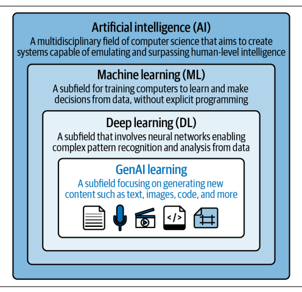
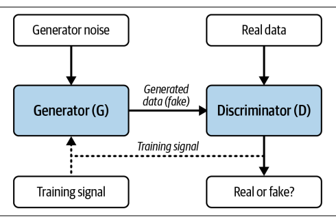
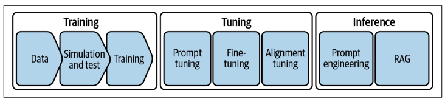
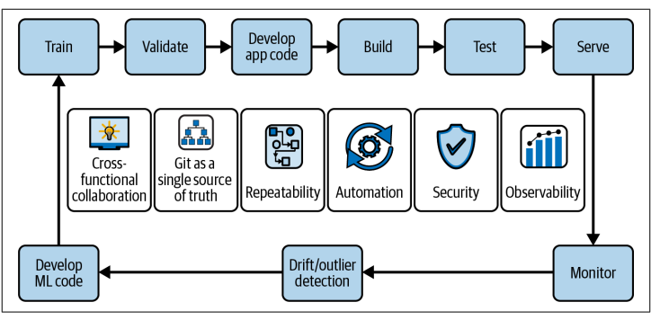

# 第1章：企业级AI难题

> **原文：** Applied AI Enterprise Java — Chapter 1: The Enterprise AI Conundrum  
> **翻译页码：** 第29–44页（共432页）

---

人工智能已迅速成为现代企业系统中不可或缺的一部分。我们目睹它如何重塑各行各业，改变企业的运作方式——也包括开发者的编码方式。然而，要理解AI的全景及其各种分类可能会让人感到不知所措，尤其是当你试图弄清楚它如何融入企业级Java生态系统和现有应用程序时。在本章中，我们旨在为你奠定基础，向你介绍构建AI赋能应用程序所必须掌握的核心概念、方法论和术语。

虽然本章的重点是铺垫基础，但它并非仅仅停留在抽象的定义或缩写上。接下来的小节将涵盖以下内容：

**从技术视角一路走到生成式AI**

虽然大语言模型（LLM）如今吸引了大部分关注，但AI领域有着更悠久的历史。了解AI是如何随着时间推移而发展的，对于决定如何在项目中使用它至关重要。AI不仅仅是关于最新趋势的，它关乎识别哪些技术是可靠的、真正可落地应用的。通过学习AI的背景以及不同方法的演进，你将能够分清哪些是炒作，哪些在日常工作中真正有用。这将帮助你在为企业项目选择AI解决方案时做出更明智的决策。

**开源模型与训练数据**

AI的表现取决于它从数据中学到了什么。高质量、相关性强且组织良好的数据对于构建产生准确可靠结果的AI系统至关重要。在这一节中，你将了解到为什么使用开源模型和数据对你的AI项目来说是一个巨大的优势。开源社区共享的工具和资源让每个人——包括小型公司——都能接触到AI领域的最新进展。

**伦理与可持续性考量**

随着AI在企业中的应用越来越普遍，思考使用这些技术的伦理和环境影响变得非常重要。构建尊重隐私、避免偏见且决策过程透明的AI系统正变得越来越关键。此外，训练大模型需要巨大的计算能力，这会带来环境影响。我们将介绍在构建AI系统时需要牢记的一些关键伦理原则，以及设计环保AI的重要性。

**LLM的生命周期及影响其行为的方式**

如果你使用过AI聊天机器人或其他能回应你问题的工具，你就已经与LLM互动过了。但这些模型并非靠魔法运作，它们遵循着一个生命周期，从训练到针对特定任务的微调。在本节中，我们将解释LLM是如何创建的，以及你如何影响它们的行为。你将学习提示调优、提示工程和对齐调优的基础知识——这些都是引导模型响应的方法。通过理解这些模型的运作方式，你将能够为你的项目选择合适的技术。

**DevOps 与 MLOps**

随着AI成为日常软件开发的一部分，理解传统DevOps实践如何与机器学习运维（MLOps）交互变得非常重要。DevOps专注于软件的高效开发和部署，而MLOps则将类似的原则应用于AI模型的开发和部署。这两个领域越来越相互关联，开发团队需要理解它们如何互补。我们将简要概述DevOps和MLOps之间的关键异同，并展示二者如何互为必要、相互关联，以成功交付AI驱动的应用程序。

**基础术语**

AI伴随着大量技术术语和缩写，很容易让人迷失在行话中。在本书中，我们将以简单清晰的语言介绍重要的AI术语。从LLM到MLOps，我们将以易于理解且与你的项目密切相关的方式逐一讲解。理解这些基础术语将帮助你与AI专家沟通，并将这些概念应用到你自己的Java开发项目中。

学完本章后，你将对AI全景和基本原理有更清晰的认识。让我们从学习一些基础知识开始，为你进入企业级AI开发之旅做好准备。

---

## AI全景：从技术视角一路走到生成式AI

生成式AI利用神经网络和深度学习算法来识别现有数据中的模式，从而生成原创内容。通过分析海量数据，GenAI算法综合知识以创造新颖的文本、图像、音频、视频和其他形式的输出。

AI的历史跨越了几十年，其间既有进步，也有暂时的挫折和周期性的突破。各个学科和专业方向可以被看作一个嵌套的盒式系统，如图1-1所示。AI的基础思想可以追溯到20世纪初，而经典AI在20世纪50年代出现，并在随后的几十年中获得了发展动力。机器学习（ML）是一个相对较新的学科，诞生于20世纪80年代，涉及训练计算机算法从数据中学习模式并做出预测。这一时期神经网络的流行受到了人脑结构和功能的启发。

**图1-1. GenAI及其在AI技术栈中的定位**

最初听起来像是各自独立的学科，其实都可以归纳在人工智能这个总称之下。而AI本身是计算机科学中的一个多学科领域，它大胆地致力于创建能够模拟并超越人类级别智能的系统。传统AI可以被看作主要是基于规则的系统，而下一个进化阶段是ML，我们接下来将深入探讨。

---

### 机器学习：当今AI的基石

机器学习是当今AI技术的基石。它是第一种让计算机能够从数据中学习而无需为每个任务显式编程的方法。ML算法不是遵循预定义的规则，而是能够分析大型数据集中的模式和关系。这使得它们能够根据学到的知识做出决策、分类对象或预测结果。ML背后的核心理念是专注于找到输入数据（特征）与我们想要预测的结果（目标）之间的关系。这使得ML极具通用性，可以应用于从图像识别到数据趋势预测的广泛任务。

ML在各个行业和领域都有深远的影响。其中一个突出的应用是**图像分类**，ML算法可以被训练来从视觉数据中识别物体、场景和行为。例如，自动驾驶汽车依赖图像分类来检测行人、道路和障碍物。

另一个应用是**自然语言处理（NLP）**，它使计算机能够理解、生成和处理人类语言。NLP有许多实际用途，例如能够进行对话的聊天机器人、客户反馈的情感分析，以及实时语言翻译的机器翻译。

**语音识别**是ML的另一个重要应用，它使设备能够将口述语言转录为文本。这项技术改变了我们与设备互动的方式。其早期迭代为我们带来了像Siri、Google助手和Alexa这样的语音助手。最后，**预测分析**利用ML分析数据并预测未来结果。例如，医疗保健提供者使用预测分析来识别高风险患者并预防并发症，而金融机构则利用这项技术预测股市趋势并做出明智的投资决策。

### 深度学习：AI武器库中的强大工具

虽然看起来大家最近只对谈论LLM感兴趣，但基础的ML理论在近年来也确实取得了实质性的进展。ML的进步之后是深度学习（DL），它为AI工具箱增添了又一次进化。作为ML的一个子集，DL使用神经网络来分析和学习数据，利用其独特的能力来学习复杂模式的层次化表示。这使得DL算法能够执行需要理解和决策的任务，例如计算机视觉应用中的图像识别、物体检测和分割。

许多人认为ML和DL是相同的，但这并不完全准确。DL实际上是ML的一个子集，专注于使用深度神经网络构建的模型，这些网络由许多层组成。传统的ML算法可以包括决策树、线性模型或浅层神经网络，而DL特指通过多层抽象学习层次化表示的架构。这种额外的复杂性赋予了DL学习数据中复杂模式和关系的独特能力。

但复杂性本身呢？在大多数情况下，DL算法确实比ML算法更复杂，因此计算成本也更高。这是因为DL需要更大量的数据来训练和验证模型，而ML通常可以使用较小的数据集。然而，尽管存在这些差异，ML和DL在各个领域都有广泛的应用——从图像分类和语音识别到预测分析和游戏AI。

关键区别在于它们对特定任务的适用性：ML更适合较简单的模式识别，而DL在处理需要数据层次化表示的复杂问题时表现出色。ML涵盖了更广泛的技术和算法，而DL特别专注于使用神经网络来分析和学习数据。

### 生成式AI：内容生成的未来

深度学习的进步为生成式AI（GenAI）奠定了基础，GenAI的核心是生成新内容，如文本、图像和代码。这一领域近年来获得了最多的关注，主要是因为它在文本生成和实时聊天方面的令人印象深刻的演示和成果。GenAI既被视为一个独立的研究学科，也被视为应用DL技术来创造新行为的一种方式。

作为一个独立的研究学科，GenAI整合了广泛的技术和方法，专注于生成原创内容，如文本、图像、音频或视频。该领域的研究人员探索各种新方法来训练模型，以生成连贯、逼真且往往富有创造力的输出，这些输出非常接近于完美地模仿人类行为。

虽然GenAI吸引了最近的大部分注意力，但理解它与预测式AI的区别非常重要。两者都属于ML的范畴，但它们服务于不同的目的。预测式AI专注于基于历史数据估计结果，而GenAI基于学习到的模式创造全新的内容。表1-1突出显示了一些主要区别。

**表1-1. 预测式AI与生成式AI对比概览**

| 预测式AI | 生成式AI |
|---------|---------|
| 基于现有数据进行预测或分类 | 生成类似于训练数据的新内容 |
| 示例：流失预测、欺诈检测、产品推荐 | 示例：文本生成、图像合成、代码补全 |
| 输出标签、概率或数值 | 输出结构化或非结构化的内容，如文本或图像 |
| 通常使用决策树、逻辑回归或浅层神经网络等模型 | 依赖大规模模型，如Transformer和扩散模型 |
| 基于准确率或错误率评估 | 基于创造力、连贯性或输出有用性评估 |

理解这种区别很有用，因为它会影响你将AI集成到应用程序中的方式。预测式AI通常在决策中扮演支持角色，而生成式AI可以通过交互和内容创作直接塑造用户体验。

GenAI的核心使用神经网络，并通过专门的架构来进一步改善DL已经能够达到的结果。例如，**卷积神经网络（CNN）**用于图像合成，从海量数据集中学习复杂的模式和纹理，使GenAI能够生成几乎逼真的图像，比以往任何时候都更接近与现实世界无法区分。同样，**循环神经网络（RNN）**用于语言建模，使GenAI能够生成连贯且语法正确的文本。可以将这个过程想象成Siri 2.0。随着Transformer架构的加入用于文本生成，GenAI能够高效地处理序列数据并几乎实时地做出响应。

特别是，**Transformer架构**通过引入更高效和更有效的序列任务架构，改变了NLP和LLM领域。其核心创新是**自注意力机制**，它允许模型同时捕获输入序列的特定部分，使模型能够捕获长距离依赖关系和上下文信息。这通过编码器-解码器架构得到增强：编码器处理输入序列并生成上下文表示，解码器基于此表示生成输出序列。

除了神经网络，GenAI还利用**生成对抗网络（GAN）**来创建新的数据样本（见图1-2）。GAN由两个组件组成：一个生成新数据样本的生成器网络，和一个评估生成样本的判别器网络。

**图1-2. GAN由两个相互竞争的神经网络组成。生成器试图创建看起来真实的数据，而判别器学会区分真假。随着时间的推移，两个网络都在改进，最终生成器产生高度逼真的输出。**

这种方法确保生成的数据不仅逼真，而且多样化且有意义。**变分自编码器（VAE）**是GenAI用于图像和音频生成的另一种DL模型。VAE学习压缩和重建数据，这种能力使应用能够生成模拟真实世界声音的高质量音频样本，甚至生成融合不同艺术家风格的图像。通过将DL技术与新的数据分块和转换方法相结合，GenAI将应用程序推向了更接近于能够生成类人内容的高度。

除了研究的进步之外，越来越复杂的计算硬件的持续发展也显著提升了GenAI的知名度——即浮点运算单元（FPU）、图形处理单元（GPU）和张量处理单元（TPU）。**FPU**擅长矩阵乘法、使用特定数学函数和归一化数据等任务。矩阵乘法是神经网络计算的基础部分，FPU被设计来极快地完成这项工作。它们还能高效处理激活函数，如sigmoid、tanh和整流线性单元（ReLU），这使得复杂神经网络的执行成为可能。此外，FPU可以执行批归一化等归一化操作，有助于稳定学习过程。

**GPU**最初为渲染图形而设计，已演变为专门的处理器，由于其独特的架构，在ML任务中表现出色。通过利用多个核心，它们可以同时处理多个任务，GPU的并行处理能力特别适合处理大量数据。**TPU**是定制构建的专用集成电路（ASIC），专门为加速ML和DL计算而设计，特别是矩阵乘法和其他DL操作。FPU、GPU和TPU提供的速度和效率提升直接影响ML模型的整体性能，不仅是训练，查询也是如此。

开发者需要考虑的一个实际挑战是在本地机器上运行LLM。虽然本地推理提供了更好的隐私保护、离线访问以及无需依赖外部API即可更快迭代等优势，但这些好处也伴随着权衡。LLM通常很大，可能消耗大量的CPU、内存和磁盘资源。这可能使本地实验变得困难，特别是在标准的开发笔记本电脑或台式机上。

然而，模型量化、容器化运行时以及Ollama和llama.cpp等工具的最新进展，使得在本地运行较小或优化过的模型变得更加实际。这些工具允许开发者在不需专用硬件的情况下探索和原型设计LLM，尽管根据用例的不同，可能仍需要一些设置和调优工作。

在后面的章节中，特别是第5章，我们将深入探讨模型分类并探索克服这个问题的策略。其中一种方法是模型量化，这是一种通过降低计算中使用的数字精度来减小模型大小和复杂度的技术，而不会牺牲太多准确性。通过量化模型，你可以减少它们的内存占用和计算负载，使它们更适合本地测试和开发，同时仍然保持接近你在生产中期望的性能水平。

---

## 开源模型与训练数据

AI生态系统中一个重要的组成部分是开源模型。你在源代码和库中所了解和喜爱的，在ML世界中不太常见，但最近获得了越来越多的关注。

### 为什么开源是GenAI的重要推动力

一个简化的AI模型视角将其分解为两个主要部分。首先，一组数学函数（通常称为**层**）被设计来解决特定问题。这些层处理数据并根据接收到的输入做出预测。第二部分涉及调整这些函数以使其与训练数据良好配合。这种调整通过一个称为**反向传播**的过程进行，帮助模型为其函数找到最佳值。这些值，称为**权重**，使模型能够做出准确的预测。

一旦模型训练完成，它由这两个主要部分组成：数学函数（神经网络本身）和权重（使模型能够做出准确预测的学习值）。函数和权重都可以像传统软件项目中的源代码一样被共享或发布。

然而，共享训练数据（权重和函数）则不太常见，因为它通常是专有的或敏感的。

正如你可能想到的，将训练最先进模型所需的大量数据作为开源提供，并非每个供应商都愿意这样做，因为这种做法可能会使公司失去竞争优势。然而，由于闭源模型可能是在受版权保护的数据上训练的，使用开源模型可以防止版权侵权并确保数据的适当归属。

就本书而言，我们仅使用开源模型——不仅因为那些大多隐藏的使用限制或法律限制，还因为我们（作者）相信开源是软件开发的重要组成部分，开源社区是一个极好的学习场所。

### 劣质数据的隐性成本：通过训练输入理解模型行为

正如你可能已经猜到的，训练数据是使模型能够生成特定功能的终极因素。例如，如果你在法律文书上训练一个模型，它将无法生成一个足够好的体育预测模型。训练数据的领域和上下文对模型的成功至关重要。

我们将在第2章讨论针对特定需求选择合适模型以及选择过程，但请注意，理解数据质量对训练模型的影响通常很重要。低质量的数据可能导致一系列问题，包括准确率降低、错误率增加、过拟合、欠拟合以及有偏见的输出。**过拟合**发生在模型将训练数据的具体细节学得太好，以至于无法泛化到新的、未见过的数据上。这意味着模型在测试或验证数据上的表现会非常差，这些数据虽然与训练数据来自同一分布，但在训练期间并未使用。

相比之下，**欠拟合**的模型就像试图将方钉塞进圆孔：它就是不匹配数据的真实本质。因此，模型无法准确预测或分类新的、未见过的数据。在这种上下文中，包含错误或混乱的数据被称为**噪声数据**。这种数据使AI模型更难准确地学习。例如，如果你正在训练一个模型来识别猫的图片，噪声数据可能包括模糊的照片、标记错误的图像，或者根本就不是猫的照片。这种不正确的或不相关的数据会混淆模型，导致它犯错误或给出不准确的结果。

此外，不一致的数据，如缺失值或对同一种信息使用不同格式，也会引发问题。如果模型没有干净、可靠的数据可供学习，它的性能将受到影响，导致糟糕或有偏见的预测。例如，如果一个AI模型是在包含偏见或刻板印象信息的数据上训练的，它最终可能基于这些偏见做出不公平的决策，这可能对人或群体产生负面影响。

你可以通过从一开始就优先考虑数据质量来减轻这些风险。这包括：从正确的来源收集高质量数据；清理和预处理数据以去除噪声、异常值和不一致性；验证数据以确保其符合所需标准；以及使用新的高质量数据定期更新和优化模型。你可能已经猜到，由于训练和优化模型通常是数据科学家的任务，这是开发者应该很少需要做但绝对需要意识到的事情——特别是当他们观察到其模型表现不如预期时。一个非常简单的相关例子是用于函数调用或Agent集成的JSON处理。虽然我们将在第3章和第8章更详细地讨论这个问题，但你需要知道，一个没有在JSON数据上训练过的模型将无法生成JSON。这是开发者经常面临的一个常见问题。

### 向LLM添加企业特定数据

除了LLM的通用技能领域之外，在某些应用中，特定任务的优化需求也在增长。这些范围可以从具有高度优化模型的小规模边缘场景，到更大规模的企业级解决方案。对于商业应用来说，最强大的功能是向模型添加企业特定数据。这使它能够更多地了解当前问题的上下文，从而提升其性能。

这听起来像是类似于数据库更新的工作，但实际上更为复杂。不同的方法提供不同的好处。在第2章讨论LLM的分类时，我们将研究可用于此目的的训练技术，并在第4章讨论架构方法。现在，重要的是要记住，没有将业务相关数据正确集成到AI赋能应用中，就不可能有任何严肃的商业应用。

### 可解释且透明的AI决策

使用开源模型的另一个优势是，它们可以支持对AI系统构建和使用方式日益增长的透明度需求。通过访问模型架构，有时甚至包括训练数据，团队可以更好地理解模型学到了什么以及它可能的行为方式。这种开放性可以帮助公司在使用的工具中建立信任，特别是在医疗保健、金融和执法等决策影响可能很严重的领域。

然而，重要的是要理解，**透明度不等于可解释性**。仅仅因为一个模型是开源的，并不意味着很容易解释它是如何得出某个特定答案的。导致模型输出的过程通常很复杂，即使对专家来说也很难追踪。**可解释AI**是一个致力于解决这个问题的独立领域，但目前的技术仍然有限，并不总是能给出清晰的答案。

**可审计性**是另一个相关的概念。这意味着能够回顾并理解模型是如何做出决策的。这并不会因为使用开源模型就自动获得。要实现可审计性，你需要适当的日志记录、输入跟踪和清晰的验证结果流程。这些是开发者和架构师需要规划的因素。

对AI系统中偏见和不公平对待的担忧也在增长。能够审查训练数据和模型行为是有帮助的，但单靠这一点还不够。需要额外的防护措施、验证步骤和人工监督来降低风险并确保公平使用。在第4章，当我们探讨如何构建负责任和值得信赖的AI系统时，我们将回到这些话题。

---

## 伦理与可持续性考量

虽然结果的可解释性是挑战的一部分，但还有许多伦理方面的考量。最重要的一点要记住的是：**AI模型由底层的训练数据定义**。这意味着AI系统将始终偏向于训练数据。这乍看起来似乎不带来风险，但存在大量的偏见潜力。例如，一个在种族主义评论上训练的模型可能偏向于白人。一个在政治评论上训练的模型可能偏向于民主党或共和党。而这些只是两个显而易见的例子。AI模型将反映并强化其训练数据中存在的社会偏见。联合国教科文组织（UNESCO）已发布了关于AI伦理的建议，这是理解模型可能具有的潜在偏见的一个很好的起点。

但在使用AI赋能应用时，还需要考虑其他问题。大模型部署的能源消耗是惊人的，因此作为软件架构师和开发者，我们有责任在运行和衡量这些系统的可持续性时密切关注。虽然有一股日益增长的运动将AI的使用引导到好的用途上（例如，朝着可持续发展目标），但解决开发和使用AI系统的可持续性问题也很重要。Emma Strubell等人的一项研究表明，在GPU上训练单个深度学习NLP模型的过程可能导致约**300吨二氧化碳排放**，这大约相当于五辆汽车在其整个使用寿命期间的总排放量。其他研究考察了Google的AlphaGo Zero，它在40天的训练中产生了近100吨CO₂，相当于1,000小时的航空旅行。在这个全球变暖和致力于减少碳排放的时代，有必要提出一个问题：使用算法来完成简单任务是否真的值得这个代价。

---

## LLM的生命周期及影响其行为的方式

现在你对AI的历史、LLM的主要组成部分以及它们是如何构建的有了更多了解，让我们更深入地看看LLM的生命周期以及我们如何影响它们的行为，如图1-3所示。

**图1-3. 训练、调优和推理**

你已经听说过训练数据，所以生命周期的核心是**训练阶段**这应该不足为奇。在这个阶段，LLM被喂入数量难以想象的数据来学习和适应。一旦LLM训练完成，它在某种程度上是一个通用模型。通常，这些模型也被称为**基础模型**。特别是如果我们看非常大的模型，例如Llama 3，它们的执行需要巨大的资源，通常特别擅长通用任务。

模型通常经历的下一个阶段是**微调**。在这里，我们调整模型的参数以优化其在特定任务或数据集上的性能。通过超参数调优的过程，模型架构师可以微调模型以获得更高的准确性、效率和可扩展性。这通常被称为**超参数优化**，包括网格搜索、随机搜索和贝叶斯方法等技术。

我们在本书中不深入探讨这两个阶段，因为它们更多是数据科学家的领域。你可以在Lewis Tunstall等人的《Natural Language Processing with Transformers》（O'Reilly出版）中了解更多关于模型训练的一般知识。不过，在后面的章节中，我们会涵盖这里略过的阶段的含义。你可以在第2章了解更多关于模型调优的开发者相关方面，在第3章了解更多关于提示工程和上下文的内容。

生命周期的最后一个，也可能是最广为人知的部分是**推理**，这是查询模型的另一种说法。在LLM的背景下，推理指的是从观察或前提中得出结论的过程，这比模型实际提供的东西要准确得多。

有几种查询模型的方式，它们会影响结果的质量和准确性，因此理解各种方法很重要。一个关键方面是你构建查询的方式，这就是**提示工程**发挥作用的地方。提示工程精心设计输入或问题，以引导模型提供最有用和最相关的回应。另一个重要概念是**数据增强**，指的是增强模型在处理过程中可访问的数据。一种强大的增强技术是**检索增强生成（RAG）**，模型将其内部知识与从数据库或文档源检索的外部最新信息相结合。在第3章中，我们将更详细地探讨这些技术。

现在，重要的是要记住，模型在软件项目中经历着一个生命周期。它们不是静态的，也不应该被当作静态的来对待。虽然推理一个模型不会以任何方式改变模型行为，但模型的知识受到其训练数据的所谓**截止日期**的限制。如果出现新信息或需要更改现有的模型"知识"，权重最终必须被调整——要么微调，要么重新训练。虽然这最初听起来像是数据科学团队的责任，但在数据科学团队和实际应用开发者的最终责任之间划出清晰的界限并不总是可能的。不过本书确实划出了一条清晰的界限，因为我们完全不涉及训练。然而，我们会更详细地研究调优技术和推理架构。但这些团队在实践中是如何协同工作的呢？

---

## MLOps 与 DevOps（以及 AIOps 和 GenAIOps 的兴起）

在过去几年中，有两个重要的术语被创造出来描述现代软件开发和生产的实践。第一个是**DevOps**，这个术语由Patrick Debois于2009年创造，指开发与运维。第二个是**机器学习运维（MLOps）**，最初由David Aronchick于2017年使用。MLOps描述了DevOps原则在ML领域的应用。最明显的区别是它们围绕的中心产物不同。DevOps团队专注于业务应用程序，MLOps团队更专注于ML模型。两者都描述了开发一个产物并使其准备好供生产消费的过程。

DevOps和MLOps有许多相似之处，因为两者都专注于简化和自动化工作流，以确保持续集成（CI）、持续交付（CD）和在生产环境中可靠部署。图1-4描述了DevOps和MLOps的一种可能组合。

**图1-4. DevOps与MLOps**

共享的实践，如跨职能协作、使用Git作为单一事实来源、可重复性、自动化、安全性和可观测性，是核心。DevOps和MLOps都依赖开发者、数据科学家和运维团队之间的协作，以确保代码、模型和配置得到良好协调。自动化和可重复性被强调用于构建、测试和部署应用程序和模型，确保一致和可靠的结果。

然而，MLOps引入了额外的层次，如模型训练和数据管理，这些不同于典型的DevOps流水线。需要持续监控模型的漂移并确保其性能随时间推移而保持，这增加了MLOps的复杂性，但两个过程都专注于安全性和可观测性，以维护生产系统中的信任和透明度。

随着MLOps的成熟，出现了一套更广泛的术语，这些术语经常互换使用或具有重叠的含义。这些包括**ModelOps**（从更普遍的意义上关注模型生命周期管理）、**LLMOps**（专注于LLM运维）和**DataOps**（强调数据流水线的可靠性和自动化）。这些术语反映了在规模化管理AI组件方面日益增长的专业化。

此外还有**AIOps**和**GenAIOps**，它们在此背景下也很相关。**AIOps**，即面向IT运维的人工智能，指的是使用ML和分析来自动化和增强IT运维任务。AIOps平台从日志、指标和链路追踪中摄取和分析数据，帮助运维团队检测异常、预测故障并减少告警疲劳。虽然AIOps不像MLOps那样专注于模型部署，但它代表了AI在生产环境中的重要应用，通常通过改善基础设施可见性和响应时间来补充DevOps实践。

**生成式AI运维（GenAIOps）**是一个新兴概念，它将MLOps原则适配到生成式AI系统（如LLM）的运维需求上。这些系统带来了新的挑战，包括提示版本管理、输入/输出验证、微调管理、上下文构建和护栏防护。GenAIOps专注于确保GenAI组件像任何其他关键应用服务一样被治理、测试、部署和监控，通常使用DevOps和MLOps团队已经熟悉的工具和工作流。

在实践中，这些学科是深度交织的，并根据组织需求而演进。一些团队可能倾向于软件工程师和数据科学家之间的紧密集成，使用共享的流水线和基础设施。其他团队可能将模型开发和生产部署的关注点分离，采用模块化和更受控的集成策略。

总而言之，虽然DevOps和MLOps共享共同的基础，但MLOps增加了数据和模型特定的关注点。AIOps和GenAIOps进一步扩展了AI在生产中的运维范围，分别针对基础设施优化和生成式模型管理。不存在唯一正确的设置，每个组织将根据其结构、专业知识和风险状况找到自己的平衡点。

---

## 本章小结

在本章中，我们探讨了AI在企业环境中应用的更广泛背景及其对开发者的意义。我们首先审视了GenAI的兴起以及它与传统预测模型的区别，介绍了现代LLM的核心能力和局限性。我们明确了预测式和生成式方法之间的差异，强调了为什么这种区别很重要，并为批判性地思考何时以及如何使用每种方法奠定了基础。

我们讨论了数据质量在塑造模型行为中的重要性，并解释了为什么训练数据的来源、结构和清洁度会显著影响结果。过拟合、欠拟合和噪声等概念被引入，不仅是作为理论概念，而且作为开发者可能遇到的实际挑战——即使他们自己并不训练模型。开发者在选择、集成和排查模型行为方面的角色贯穿始终被强调。

我们还涵盖了围绕AI运维出现的关键术语，包括DevOps、MLOps以及较新的AIOps和GenAIOps领域。这些帮助将AI应用置于熟悉的工程上下文中，展示了AI工作流如何融入现有的开发和部署实践。理解这些术语对于希望跨团队有效工作并应对不断演变的职责的开发者至关重要。

最后，我们反思了开源在企业AI中的价值。虽然开源模型支持透明度并在可控性和灵活性方面提供优势，但我们也澄清了透明度本身并不等于可解释性。可审计性、偏见缓解和法规遵从等概念需要它们自己的工具和实践。开发者在实施防护措施、验证输出和确保模型在生产中负责任地运行方面扮演着关键角色。

本章的目标不是深入技术实现，而是让你对企业AI全景、围绕它的术语体系以及将塑造你作为开发者工作的架构关注点有一个扎实的理解。在接下来的章节中，我们将在此基础上继续构建——首先是关于如何为特定任务选择合适的模型，以及需要什么来使它们在真实的软件系统中可用。

> **第2章** 将介绍LLM的各种分类，并揭示它们更多的内部运作机制。我们将概述用于描述这些模型的最常见分类法。我们还将深入探讨调优这些模型的机制。

---

*翻译：第29–44页（第1章完） | 原书共432页*
