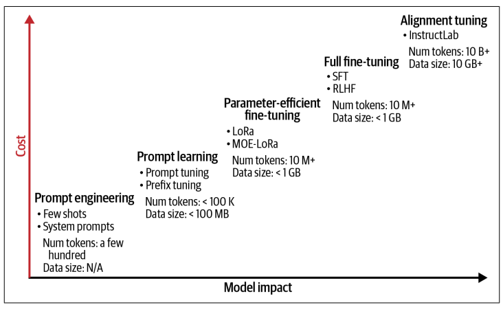

# 第2章：新型应用程序

> **原文：** Applied AI Enterprise Java — Chapter 2: The New Types of Applications  
> **翻译页码：** 第45–72页（共432页）

---

Java开发者花了几十年时间打磨构建可扩展、可维护和高性能应用程序的最佳实践。从企业级Web服务到云原生微服务，Java语言及其生态系统一直被真实世界的应用需求所塑造。如今，随着GenAI和其他AI赋能能力的出现，新型应用程序变得更加突出，需要额外的知识、架构和工具。

我们希望你已经理解，GenAI并非与过去的进步彻底决裂，而是DL领域AI研究与软件工程基础相结合的演化产物。正如Java开发者已经适应了从单体到微服务、从命令式到响应式编程的转变，他们现在面临的挑战是如何将AI模型集成到应用程序中，同时遵循他们早已熟知的那些原则：模块化、可扩展性、可测试性和可维护性。

要在Java应用中有效使用AI，理解这些系统运作所依赖的基础组件不仅有用，而且必要。由于其中一些组件的复杂性和新颖性，我们决定在各章中逐层揭开它们。在本章中，我们将分解AI集成的关键方面：

**理解大语言模型**

LLM是一类特殊的AI模型，在海量文本数据上训练以执行NLP任务。我们将探索它们如何生成响应，讨论它们的局限性，并为你介绍更多相关细节，以帮助你分类模型并为你的需求选用合适的模型。

**理解模型类型**

并非所有AI模型都是相同的。虽然像LLM和扩散模型这样的生成模型吸引了最多的关注，但它们只是AI全景中的一部分。我们将探索不同类型的模型，包括分类器和嵌入模型。

**支撑技术**

AI模型并非孤立运行，它们依赖丰富的工具和框架生态系统。从高效存储和检索知识的向量数据库，到将模型作为服务暴露的API，理解AI技术栈对于想要构建既强大又可维护应用的Java开发者至关重要。

**教会模型新把戏**

与传统软件不同，AI赋能的应用通过多种方式改进：微调、检索增强生成（RAG）和强化学习。我们将讨论这些技术及其权衡，特别是在需要可控性和定制化的企业环境中。

听起来要覆盖的内容很多，但我们承诺在可能的地方保持简洁，为你配备最基本的知识。

---

## 理解大语言模型

作为一名Java开发者，你可能习惯于处理结构化数据、类型安全的环境以及对程序执行的显式控制。LLM的运作方式则完全不同。它们不是像Java方法那样执行预定义的指令，而是基于学到的模式以概率方式生成响应。你可以将LLM看作一个打了兴奋剂的强大自动补全函数——它不仅预测下一个字符，还理解整个对话的广泛上下文。

如果你曾经使用过编译器，你就知道源代码在执行前会被转换为中间表示。类似地，LLM并非直接处理原始文本，而是将其转换为数值表示以提高计算效率。你可以将其与Java字节码进行比较——虽然人类可读的Java代码是结构化且易于理解的，但JVM执行的是编译后的字节码。在LLM中，**分词（Tokenization）**扮演着类似的角色：它将人类语言翻译成模型可以处理的数值格式。

另一个有用的比较是Java虚拟机（JVM）管理即时编译（JIT）的方式。JIT编译器在运行时根据执行模式动态优化代码。类似地，LLM动态调整其文本生成，基于概率分布预测词语，而不是遵循硬编码的规则集。这种概率特性使它们灵活且富有创造力，但也意味着它们有时会产生不可预期或不完整的结果。现在，让我们分解它们的组成部分，从关键元素开始。

### 大语言模型的关键元素

LLM依赖几个基础元素，这些元素定义了它们的有效性和适用性。虽然训练数据很重要，但其他元素也发挥着各自的作用。例如，注意力机制允许模型衡量序列中不同词语的重要性，而分词策略决定输入的处理效率。此外，上下文长度、内存约束和计算效率等因素决定了LLM处理复杂提示和交互的能力。对这些核心组件的基本理解是将这些新功能成功集成到应用程序中所必需的，因为它们影响性能、可扩展性和整体用户体验。

#### LLM如何生成响应

在高层次上，LLM处理文本输入（自然语言理解，NLU）并生成有意义的响应（自然语言生成，NLG）。你需要理解一些缩写和术语，以便理解模型用例，并为你的特定应用决定使用哪个模型：

**自然语言理解（NLU）**

NLU专注于解读和分析人类输入。它用于意图识别、实体提取、文本分类和情感分析等任务。这在概念上类似于Java应用程序解析JSON或XML，提取关键数据用于业务逻辑。如果你正在构建AI驱动的搜索或推荐系统，一个为NLU优化的编码器模型（例如BERT，本章后面会介绍）通常是一个很好的选择。

**自然语言生成（NLG）**

NLG负责构建有意义且连贯的响应。这对聊天机器人、报告生成和文本摘要非常有用。在概念上，这类似于Java的模板引擎（例如Thymeleaf和Apache FreeMarker），它们基于结构化输入动态生成输出。解码器模型（例如GPT，本章后面也会介绍）更适合这些任务。

**分词（Tokenization）**

在处理之前，LLM将输入和输出分解为更小的块（token），类似于Java使用`StringTokenizer`或正则表达式（regex）对字符串进行分词的方式。Token限制影响模型在单次请求中能"记住"的上下文量。在输出token时，模型会添加一定程度的随机性，注入非确定性行为。这种随机性是为了模拟创造性思维过程而添加的，可以通过一个称为**温度（temperature）**的模型参数进行调整。

**自注意力机制（Transformer架构）**

基于Transformer构建的LLM使用自注意力机制来确定句子中哪些词语（token）最重要。模型不会平等对待每个词，而是根据它们与整体含义的相关性，为关键词分配更高的重要性——或注意力。这个过程就像IDE的调试器在给定断点处高亮显示最相关的变量或表达式：作用域内的值、最近的赋值或逻辑中的关键分支获得你的关注，而其余部分则淡入背景。同样，在自注意力中，模型动态地聚焦于上下文最重要的token，以有效理解和生成语言。

**上下文窗口**

上下文窗口类似于Java中的缓冲区大小或栈帧。正如Java中的方法有有限的栈帧大小来存储局部变量，LLM有固定的内存空间来存储输入和输出token。例如，具有4,000个token上下文窗口的LLM（如GPT-3.5）一次可以处理大约3,000个单词，然后丢弃较旧的token。更大的模型（例如GPT-4 Turbo、Claude 3 Opus）支持超过128,000个token，允许更长的交互而不丢失过去的上下文。

你现在已经了解了基本术语，但关于模型如何工作还有更多内容需要了解。最重要的部分是底层的模型架构。你现在不需要记住所有这些，我们只是不想在后面的章节中使用某些描述时让你感到惊讶。将以下概述当作一个当你之后在书中遇到困惑时可以回来查阅的地方。

#### 模型架构

正如Java库为特定工作负载而设计（Quarkus用于微服务、Apache Lucene用于搜索、Jackson用于JSON处理），不同类型的AI模型也为特定用例进行了优化。LLM通常分为三类：仅编码器、仅解码器和编码器-解码器模型，每种都有独特的特征。

**仅编码器模型。** 这些模型，如BERT、RoBERTa和E5，设计用于理解文本而非生成文本。这些模型一次性处理整个输入，提取语义含义和词语之间的关系。它们广泛用于RAG流水线中，其生成向量嵌入的能力使得在Weaviate、Pinecone和Facebook AI相似性搜索（FAISS）等向量数据库中进行语义搜索成为可能。通过将文本转换为数值表示，这些模型通过基于含义而非关键词检索相关文档来增强企业搜索。你可以将编码器模型与传统的基于Lucene的搜索引擎集成，以结合词汇和语义检索技术，提高搜索结果的准确性和相关性。

除了搜索，编码器模型在分类任务中也很有价值，例如聊天机器人的意图识别、垃圾邮件检测和欺诈分析。它们支持命名实体识别（NER）和信息提取，在需要从法律、金融或合规相关文本中提取结构化数据的文档处理应用中非常有用。在推荐系统中，这些模型生成嵌入以帮助将用户与相关文章、文档或产品匹配，改善个性化体验。安全应用也受益于编码器模型，因为它们可以在系统监控和欺诈预防工作流中对日志进行分类并检测异常。虽然Java开发者通常不直接在JVM中运行这些模型，但他们可以通过外部推理服务（如Hugging Face或Amazon Bedrock）访问它们。

**仅解码器模型。** 这些模型，如GPT、Llama和Mistral，专注于文本生成。与一次性分析整个输入的编码器不同，解码器一次生成一个token，基于先前的上下文预测下一个词。这使它们非常适合聊天机器人和对话式AI，在这些场景中，动态的、上下文感知的响应是必需的。集成AI驱动客户支持的Java应用可以使用解码器模型生成回复、辅助客服人员提供建议响应并提供自动化的洞察。在软件开发中，解码器模型广泛用于代码生成和自动补全，通过预测Java代码片段、完成函数调用甚至用自然语言解释复杂代码来帮助开发者。基于Java的企业应用也可以利用这些模型进行报告生成和内容自动化，创建摘要、法律文档和个性化的客户沟通。在文本重写和摘要中，解码器模型可以被应用于动态地简化、释义或扩展内容，增强内容创建工作流。

**编码器-解码器模型。** 这些模型，如T5、BART和FLAN-T5，结合了两种架构的优势，使它们在结构化的输入到输出转换中特别有效。与顺序生成文本的仅解码器模型不同，编码器-解码器模型首先使用编码器处理输入，然后使用解码器生成结构化输出。这种设计非常适合机器翻译，使Java应用能够通过实时翻译UI元素、电子邮件和用户生成的内容来支持多语言用户。文档本地化是另一个实际用例，允许企业高效地翻译软件手册和API文档。在文本摘要中，这些模型从大型文档（如法律合同、财务报告或监控日志）中提取关键信息，使复杂信息更易于审阅。处理知识管理系统的Java开发者可以使用编码器-解码器模型来优化、释义和重组内容，确保企业沟通的清晰性和一致性。

LLM架构的最新进展集中在提高效率而不牺牲性能。**专家混合（MoE）**等技术，在GPT-4.5和Gemini 2.5等模型中使用，在推理期间仅选择性地激活部分模型参数，在保持高准确率的同时减少计算开销。这种方法在概念上类似于Java框架中的延迟加载机制，即资源仅在需要时加载。量化和模型蒸馏允许开发者部署更大模型的更小、资源高效版本，而不会显著损失准确性，就像JVM优化提高运行时性能一样。新兴的内存高效技术，如flash attention和稀疏计算，进一步降低了硬件成本，类似于Java使用内存映射文件来优化高吞吐量应用程序的性能。

选择合适的模型取决于应用程序的具体需求。在RAG流水线中集成语义搜索的Java开发者将从BERT或E5等仅编码器模型中获益最大。需要基于聊天的交互、代码建议或动态内容生成的应用最适合GPT或Llama等仅解码器模型。对于涉及机器翻译、结构化文档转换和摘要的任务，T5或FLAN-T5等编码器-解码器模型提供最佳结果。理解这些架构使开发者能够做出明智的决策，在将AI集成到企业Java应用中时平衡准确性、效率和成本。

#### 规模与复杂度

LLM有各种大小，通常按其参数数量来衡量。参数本质上是定义模型预测和生成文本能力的内部数值。正如Java开发者仔细选择合适的数据库、缓存策略或框架来平衡性能和可扩展性一样，选择合适的LLM大小可以确保高效的推理、成本效益和部署可行性。

**较小模型**，通常在70亿到130亿参数范围内（例如Mistral 7B、TinyLlama），针对本地执行进行了优化，需要最少的计算资源。这些模型非常适合需要低延迟响应的应用，如边缘AI、嵌入式系统或轻量级聊天机器人应用。在本地运行这样的模型相当于使用像SQLite这样的嵌入式数据库——它高效、自包含，对单用户工作负载很实用。

**中型模型**，范围从300亿到650亿参数（例如Llama 65B），提供更好的上下文感知能力和准确性，但需要更高的内存和GPU资源。它们非常适合企业应用中的服务器端部署，为AI驱动的客服机器人、企业搜索、文档摘要和智能自动化工具提供动力。它们的基础设施占用类似于管理Redis缓存层或轻量级微服务集群，其中性能优化对于避免过度资源消耗至关重要。

#### 模型命名里的学问

模型名称通常包含后缀，表明其预期的用例或优化级别。**Base（基础）**模型是未经修改的基础模型，在大规模数据集上训练，没有特定的微调。**Instruct（指令）**或**Chat（对话）**变体适用于交互式对话任务，使其成为聊天机器人开发的理想选择。**Code（代码）**模型在编程语言上进行了微调，对代码补全、Bug修复和AI辅助软件开发很有用。其他常见的后缀如**QA**（问答）和**RAG-ready**（检索增强生成优化）表示模型专门为企业知识检索和基于文档的AI工作流进行了调优。

在最高层，超过1,750亿参数的大规模模型，如GPT-4o（OpenAI）、Claude 3.5（Anthropic）和Gemini 1.5 Ultra（Google DeepMind），需要专用硬件和分布式推理。这些模型具有卓越的上下文推理能力、多轮对话能力和复杂问题解决能力。然而，基础设施需求巨大，因为它们的规模和能源消耗，需要基于云的推理解决方案。使用这些模型类似于操作像Apache Kafka或Elasticsearch这样的分布式系统，其中可扩展性和资源分配是主要关注点。大多数与大型模型交互的Java开发者将通过云API来集成它们到应用中，而不需要直接管理基础设施。

> **等等，"70亿参数"到底是什么意思？** 当我们说Mistral 7B有70亿参数时，我们指的是定义模型行为的可训练权重的总数。这些参数存储在张量（tensor）中。这些参数定义了模型处理输入数据和生成输出的方式，类似于Java开发者配置类变量和常量来决定应用程序的行为。用数学术语来说，LLM本质上是一个具有数十亿参数的巨型函数，这些参数作为多维张量存在。一个简单的类比是Java通过多维数组处理矩阵。
>
> 假设我们有一个用于图像处理的Java程序，使用三维数组来表示RGB图像：
> ```java
> int[][][] image = new int[256][256][3]; // 一个256x256的图像，包含3个颜色通道
> ```
> 在DL中，张量的工作方式类似，但规模大得多。一个LLM层可能有形状为`[12288, 4096]`的权重张量，意味着它有12,288个输入特征和4,096个输出特征。这就像一个大邻接矩阵，其中每个权重值决定了一个输入如何影响一个输出。使用预训练LLM意味着处理以Safetensors或GPT生成统一格式（GGUF）等格式存储的张量权重。这些格式高效地将预计算的参数加载到内存中，类似于Java将编译后的字节码加载到JVM中执行。

张量有不同的精度。虽然模型的参数数量定义了其推理能力、上下文深度和整体准确性，**张量类型**决定了这些参数的存储、加载和处理效率。张量类型的精度越高，每个参数需要的内存和计算能力就越多。另一方面，低精度张量允许压缩和更快的执行，使更大的模型能够在更小的硬件上运行。它们有全精度（FP32或FP16）和量化（INT8、INT4）版本。对于超过1,750亿参数的大规模模型，全精度推理仅在超大规模分布式系统上可用——想想分布式数据库分区和处理大数据集的方式。对于较小或本地部署，INT8或INT4量化减少了内存占用，同时仍保持功能性的准确率。

**通过量化和压缩优化模型大小。** 量化和压缩是用于减少LLM内存和计算占用的标准技术。量化通过降低模型权重的精度来工作，通常从32位浮点（FP32）降到FP16、INT8甚至INT4等格式。这显著减小了模型大小和推理成本，使得在更受限制的硬件（如CPU或消费级GPU）上执行成为可能。这类似于音频压缩格式：正如将WAV文件转换为MP3以牺牲一些保真度为代价来减小文件大小，量化以最小但可能可察觉的输出精度影响来压缩模型权重。尽管如此，许多量化模型（特别是那些使用优化的量化感知训练或后训练技术的模型）在大多数常见任务上的表现几乎与全精度对应版本一样好。

**权重剪枝**和**蒸馏**等压缩技术进一步减小了模型大小。权重剪枝移除不太关键的参数，有效地缩小模型，同时保持其大部分预测能力。另一方面，蒸馏涉及训练一个较小的"学生"模型来模仿较大的"教师"模型，在捕获其行为的同时更加高效。可以将这个过程想象为类似于JVM中的JIT优化或搜索引擎中压缩索引的使用，其中在不牺牲太多准确率的情况下实现效率。

总之，以下是参数及其派生精度如何帮助优化性能和硬件需求：

- **内存考量** — 70亿参数必须加载到GPU VRAM或RAM中。使用FP16张量而非FP32可减少一半内存使用。
- **推理速度** — 更大的模型每个生成的token需要更多的张量计算。使用量化的INT8或INT4模型减少处理时间，代价是轻微准确率损失。
- **上下文窗口** — 更多上下文（更长的输入提示）意味着更多的激活，增加VRAM使用。4,000 token上下文消耗的内存明显多于1,000 token上下文。

现在你已经理解了LLM的基本概念、它们的架构以及它们如何生成响应，我们可以转向这些模型如何部署、在生产中运行以及集成到Java应用中。

### 模型部署

到目前为止，我们已经探索了Transformer模型的内部工作原理，让你对它们的功能以及该领域的常见术语和缩写的含义有了基本的了解。创建、训练和提供这些模型的世界主要以Python为中心，Java的参与非常少。虽然存在一些例外，如TensorFlow for Java，但大多数工具和框架都是为Python设计的。

部署LLM需要几个步骤。首先，模型必须以与推理引擎兼容的格式导出，推理引擎负责加载模型权重、优化执行和管理GPU内存等资源。与传统Java应用不同，AI模型以ONNX、GGUF或Safetensors等格式打包，每种格式针对不同的执行环境设计。选择推理引擎决定了模型运行的效率、支持的硬件以及与现有应用程序的集成程度。虽然Java开发者通常不做这些选择，但他们确实帮助制定非功能性需求，从而引导正确的选择，因为它直接影响延迟和吞吐量等因素，这些都需要与你的应用程序需求对齐。

在现代云原生架构中，推理引擎通常作为服务访问，部署在本地、云端或容器化环境中。Java应用通过REST API或gRPC与这些服务交互，发送输入数据并接收模型预测。这符合可扩展的、基于服务的架构，其中AI模型被部署为独立服务，可以像其他应用组件一样进行负载均衡和自动扩展。许多云托管的服务（如OpenAI和Hugging Face）以及来自AWS、Microsoft Azure和Google Cloud的云推理端点暴露了标准化的API，使Java应用能够无缝集成，无需直接进行模型部署。你将在第6章了解更多关于推理API和选定供应商的信息。

对于自托管或设备端模型，Java可以通过Java本地接口（JNI）或Java本地访问（JNA）利用本地绑定直接调用推理引擎如llama.cpp或ONNX Runtime，无需外部服务。对于需要低延迟、设备端推理的场景，Java应用程序可以与Deep Java Library（DJL）等框架集成，该框架提供了高级API来直接在支持的硬件上加载和执行模型。

#### 主流推理引擎

考虑到以上所有内容，让我们看看一些最流行的用于LLM部署的推理引擎、它们的能力以及如何通过Java访问它们：

| 引擎 | 描述 | Java集成方式 |
|------|------|-------------|
| **vLLM** | 针对高吞吐量、低延迟LLM服务优化的推理引擎，具有PagedAttention等高效内存管理技术 | OpenAI兼容的API服务器 |
| **TensorRT** | NVIDIA SDK，在NVIDIA GPU上运行LLM，提供图优化、量化支持（FP8, INT8, INT4）等 | 通过Triton推理服务器，提供多种客户端库 |
| **ONNX Runtime** | 为转换为ONNX格式的模型提供优化推理，支持CPU、GPU和专用AI加速器上的跨平台执行 | 原生Java绑定 |
| **llama.cpp** | 设计用于在标准硬件上运行量化模型（GGUF格式）的推理引擎，无需GPU | 通过JNI绑定或REST API封装 |
| **OpenVINO** | Intel设计，用于在Intel特定处理器上优化AI工作负载 | JNI绑定和REST API封装 |
| **RamaLama** | 从OCI镜像促进AI模型的本地管理和服务（OCI是Linux基金会项目，定义容器格式和运行时规范） | 使用llama.cpp REST API端点 |
| **Ollama** | Ollama服务器和多种在本地硬件上运行模型的工具 | 原生Java客户端库或REST API端点 |
| **Jlama** | 纯Java原生构建的现代LLM推理引擎 | 直接Java集成 |

在本地运行模型和推理引擎时，容器化简化了将运行时、库和优化打包到统一环境中的过程。一些推理引擎已经提供了预构建的容器。Podman等工具进一步简化了这些容器的管理，包括拉取模型镜像或为你的特定硬件创建自定义容器的能力。Podman Desktop提供了一个用户界面，方便快速启动和测试这些AI服务。我们将在第5章更仔细地了解如何使用Podman Desktop。

但这还不是全部。随着技术的快速发展，还有更多专门化的方式来访问模型，如下所列。而且看起来这些选项短期内不会放缓：

- **云原生服务** — AWS、Google Cloud和Azure等云平台提供完全托管的模型服务解决方案。你可以通过各自的市场或工具部署模型，通常具有自动扩展和内置监控。这减少了运维开销，但可能引入供应商锁定。
- **边缘AI** — 在边缘（IoT设备或本地网关）部署模型可减少延迟和网络使用。面向边缘AI的框架通常包含针对低功耗硬件的优化，使其适用于远程位置的实时或任务关键场景。
- **模型注册表** — 模型注册表帮助你存储和组织已训练模型的版本。Hugging Face Model Hub等流行服务允许你发现、共享或微调社区模型，有助于可重现性和轻松更新。
- **Knative Serving** — 这个Kubernetes的无服务器框架自动化了容器化工作负载的扩展、部署和版本管理，可以简化AI推理服务与其他云原生应用在统一环境中的托管。

你现在已经对模型内部工作原理以及它们如何被服务有了很好的概述。我们现在转向可以对模型进行的更精细的调整。

### 模型推理的关键超参数

我们已经讨论了模型参数，但还有更多需要讨论的内容：**超参数**通过优化推理速度、响应质量和内存效率来提供帮助。参数（权重）定义模型学到的知识，而超参数控制推理行为，允许开发者微调模型响应的创造力、准确性和效率。其中许多可以通过API调用或Java API更改。你应该尝试超参数调优，以为你的用例实现最佳结果。使用超参数有助于在精确的、确定性的输出和创造性的、开放式的响应之间达到最优平衡。以下是最常见的超参数：

**温度（Temperature）** — 控制文本生成的随机性：
- 低值（0.2–0.5）产生确定性、事实性的响应。温度=0.2："Java垃圾回收自动管理内存。"
- 高值（0.7–1.2）推动更具创造性、多样化的输出。温度=1.0："Java的垃圾回收就像一个看不见的清洁工，动态地整理内存。"

**Top-k采样** — 将token选择限制为概率最高的前k个token。较低的k导致更确定性的响应，较高的k增加可变性。

**Top-p采样（核采样）** — 从概率质量的前p%中选择token。通过动态调整采样帮助生成更自然的声音响应。

**重复惩罚** — 惩罚或减少最近已出现token的生成概率。鼓励模型生成更多样化、非重复的输出。

**上下文长度** — 定义模型在单次请求中记住的token数量：
- 短上下文：推理更快，但可能丢失早期对话轮次或文档段落
- 长上下文：支持跨更长输入或多轮交互的更深入回忆，但内存和计算需求增加

务必检查你的API文档以确认支持哪些超参数（如果有的话）。

### 模型调优：超越输出微调

到目前为止，我们已经讨论了模型、适配器和调优，但我们尽量不让你被那些不直接适用于模型使用的知识所淹没。然而，有时仅仅使用现有模型并略微调整其输入和输出是不够的，而且你找不到针对你的用例的特定模型。这时你不得不寻找其他方法来创建特定的适配，甚至创建一个新模型。

我们希望确保你理解影响模型行为的各种方式，按照复杂度和侵入性排列，让你更好地理解哪些事情你大概可以自己做，以及何时需要数据科学家的帮助。我们不会在此涵盖所有细节，因为大部分属于纯粹的数据科学家专业领域，但为了完整性还是想提及它们。你可以在Chip Huyen的优秀O'Reilly著作《AI Engineering》中了解更多。传统意义上的调优会改变模型权重，将预训练模型适配到特定需求。但你可以以多种方式改变模型行为而不改变预训练模型，只改变其内部工作方式。这种方法称为使用**模型适配器**，允许基础模型保留其通用知识，而适配器层在其上添加任务特定的知识。

常见的适配器技术包括：

- **低秩适配（LoRA）** — LoRA将小的可训练层插入现有的Transformer权重中，而不是修改整个模型。
- **参数高效微调（PEFT）** — PEFT涵盖各种适配器技术，包括LoRA、前缀调优和适配器层，以高效微调模型，同时保持大多数参数不变。
- **前缀调优和提示调优** — 这些方法在输入提示中添加可训练前缀，而不是修改模型权重，允许在更接近模型的地方进行任务特定定制。可以将其视为内建的系统提示。

适配器模型可以通过推理引擎中的各种技术进行集成，并有效地层叠在现有模型之上。可以将其想象为容器的附加层。适配器通常在模型名称中被引用，其文档说明它们被适配的应用场景。

当数据科学家谈论微调时，他们可能指的是具有不同复杂度和成本影响的不同事物。图2-1为你提供了各种方法的概述，按工作量及其对某些场景的有用性进行了排序。



**图2-1. 应用于LLM的常见调优技术**

让我们更详细地看看每一种方法。

**提示调优（Prompt Tuning）。** 提示调优就像优化SQL查询或调整配置文件，其中对输入的调整可以改善整体性能，而不需要修改底层系统。这个过程与提示工程不同，后者更侧重于在没有系统化实验的情况下编写更好的提示。提示调优系统地优化输入模式和嵌入，使模型产生更理想的输出。应用程序或自动化系统通常通过使用结构化模板实现提示调优，这些模板基于用户交互修改提示。这使开发者能够以最小的开销引导模型行为，使其成为改善AI响应的一种易于使用且具有成本效益的方法。然而，与微调不同，提示调优不会改变模型的内部参数，这意味着其有效性受到基础模型现有能力的约束。

**提示学习（Prompt Learning）。** 提示学习扩展了提示调优，通过使用结构化的输入-输出提示对来训练模型。这使模型能够基于结构化示例而不仅仅是试错来优化其响应。这通常通过微调方法完成，其中带标签的示例指导模型的学习，帮助它适应特定的模式或期望的行为。一种有效的方法是使用LoRA，它允许在不重新训练整个模型的情况下进行调整，使其更加高效和资源友好。这种方法主要用于需要预定义响应结构的应用。好的例子包括在AI生成的文本中强制执行合规性、在客户支持交互中保持一致性或应用业务逻辑护栏。它可以大致被比作编写测试驱动开发（TDD）测试，其中预期的输入和输出帮助迭代地优化软件行为，确保模型性能可预测并随时间改善。与使用预训练适配器不同，这将需要由数据科学家执行。

**PEFT和LoRA。** 如前所述，模型适配器允许开发者修改特定行为而无需重新训练整个模型，使这种方法更加易于使用。

**全量微调（Full Fine-Tuning）。** 全量微调意味着通过在领域特定数据上重新训练来调整所有模型权重，需要专业知识和巨大的计算资源。这个过程类似于用一个新框架版本重新编译整个应用程序，而不仅仅是升级单个依赖项。与较轻的调优方法不同，全量微调需要ML专业知识、访问高性能硬件以及准备充分的数据集以确保最佳结果。由于这些复杂性，它通常不为传统开发者所接触，而是由专门的数据科学团队来完成。

**对齐调优（Alignment Tuning）。** 对齐调优调整模型的输出以确保符合伦理指南、安全法规和行业标准，使其成为负责任的AI部署的关键。这个过程修改模型的决策过程，以与预定义的规则对齐，就像定义安全策略和实现基于角色的访问控制（RBAC）来在整个系统中强制执行访问限制一样。类似于强制执行API速率限制、部署安全补丁或在企业层面建立治理策略，对齐调优确保AI在可接受的边界内运行，减轻与非预期行为或有偏见的决策相关的风险。

InstructLab项目通过对齐调优采用了一种新颖的方法，使用合成数据生成和基于人类反馈的强化学习（RLHF）来优化AI行为。InstructLab生成经过精心筛选的数据集，帮助模型学习伦理推理、行业特定法规和业务逻辑，同时确保跨应用的知识一致性。这种方法允许开发者集成可适应合规需求而不需要全量重新训练的AI系统，在保持安全性和可靠性的同时降低了成本和努力。

表2-1提供了调优方法的完整概述，包括各自的资源和成本影响，以及它们的优缺点指示。

**表2-1. 调优方法概览**

| 方法 | 工作量 | 资源 | 成本 | 所需技能 | 优点 | 缺点 |
|------|--------|------|------|----------|------|------|
| 提示调优/提示工程 | 低 | 最少 | 低 | 开发者 | • 不需要额外基础设施<br>• 即时、易于更改<br>• 适合小调整 | • 有限的控制深度<br>• 需要试错 |
| 提示学习 | 中 | 中等 | 中 | 数据科学家 | • 更好的可靠性<br>• 无需参数更改 | • 需要标注数据<br>• 受模型约束限制 |
| PEFT/LoRA | 中 | 中等 | 中 | 开发者、数据科学家 | • 比全量微调训练成本低<br>• 可在标准GPU上运行<br>• 适配模型而不丢失原始知识 | • 需要数据准备和更新<br>• 收益因任务复杂度而异 |
| 全量微调 | 非常高 | 巨大 | 非常高 | 数据科学家 | • 最大行为控制<br>• 适合专有或高度特定任务 | • 高计算/存储成本<br>• 需要高级ML专业知识 |
| 对齐调优 | 高 | 高 | 高 | 开发者 | • 确保伦理AI<br>• 对受监管行业至关重要 | • 实现复杂<br>• 需要专用AI基础设施<br>• 高持续成本 |

重要的是要注意，虽然提示调优和工程对开发者来说是可以接触的，但像全量微调和对齐调优这样更复杂的方法需要通常在数据科学团队中才能找到的专业知识和资源。然而，开发者为他们的应用选择正确的模型是责无旁贷的。

---

## 为你的应用选择合适的LLM

对LLM进行分类是困难的，因为它们具有多样化的能力、架构和应用场景。在为你的项目选择LLM时，基于共同属性对可用选项进行分类是有帮助的。正如评估你在应用中使用的其他每个服务或库一样，你需要同时考虑功能性和非功能性需求。

利用我们到目前为止讨论的所有信息，本节包括一组常见的类别和属性，可能帮助你对你的应用需要哪种模型做出决策。然而，请记住，你可能需要考虑额外的属性，而最终选择通常取决于评估结果——这通常是由数据科学家处理的任务。你可以在《AI Engineering》第3章中找到对模型评估的更深入理解。

### 模型类型

选择合适的LLM类型取决于你计划如何使用它，需要平衡特异性、效率和适应性。我们可以按模型生成、检索或理解文本及其他输入的方式来分组模型。

**文本生成模型**在开放式任务中表现良好，如聊天机器人、自动化文档和摘要。它们可能需要调优以对齐业务需求。**指令调优对话模型**专攻对话界面，使其适合客户支持和AI驱动的助手；它们以精细化的上下文理解响应结构化提示。

如果用例需要外部知识，**RAG模型**集成动态数据源以获得更准确的、领域特定的答案。**嵌入模型**专注于语义搜索、分类和相似性匹配，以增强AI驱动的搜索和推荐系统。**多模态模型**处理图像和文本，用于OCR或基于图像的问题回答等任务。**代码生成模型**致力于提升开发者生产力，辅助自动重构和AI辅助编码。**函数和工具调用模型**与企业系统交互，自动化工作流或触发特定的API操作。

在这些选项之间做决定时，考虑你是需要自由形式的文本生成、结构化响应、外部知识，还是像编码或多模态能力这样的专门功能。**输出格式**是你的主要决策类别。

### 模型规模与效率

模型规模影响成本、准确率和延迟。小模型（70亿参数或更少）适合边缘或本地部署，其中低延迟和有限资源最为关键。中型模型（70亿–300亿参数）平衡了效率和性能，使其成为一个无需过多基础设施需求的折中选择。大模型（300亿参数或更多）提供高级推理能力，但需要大量计算资源。

决定是优先考虑更低的成本、更高的性能，还是与现有硬件的兼容性。在许多场景中，较小或量化的模型可以提供接近大模型的结果，在不失去基本功能的情况下降低硬件投资。

### 部署方式

你选择的部署策略影响可扩展性、数据安全性和运维复杂度。考虑以下选项：

- **基于API或第三方托管的模型**易于集成，几乎没有基础设施开销。它们容易扩展，但可能引发关于供应商锁定、延迟和持续使用费用的担忧。
- **自托管模型**提供对数据的更多控制，并且在大规模扩展时可以降低推理成本。然而，它们需要管理GPU或其他专用硬件并处理持续优化。这种方法适合有严格合规需求的企业或那些旨在减少对外部供应商依赖的企业。
- **边缘或本地部署**提供低延迟、离线操作。它们非常适合移动设备、IoT设备或开发者机器。但它们受限于模型规模和复杂度的降低。

你的选择取决于集成的便利性、安全要求和成本约束。如果你处理敏感数据，你会希望使用自托管或混合方法。当你想快速部署和扩展时，可以选择基于API或第三方的模型。

### 支持的精度与硬件优化

你已经了解了数值精度如何影响速度和内存使用。全精度（FP32、BF16、FP16）提供最高的准确率。量化模型（INT8、INT4）减少内存需求并提供更高速度。此外，硬件选择影响可用的精度选项。例如，CUDA和基于TensorRT的推理为NVIDIA GPU优化性能，而ONNX、OpenVINO和Core ML为Intel或Apple Silicon开辟了部署可能性。评估你是需要专用加速器还是通用硬件足够即可。

### 伦理考量与偏见

在广泛数据集上训练时，偏见和伦理风险会出现。缓解策略有助于确保公平性并与法规保持一致。一些企业模型实现了内建的偏见过滤，而开源模型可能需要额外的监督来管理潜在的有害输出。

法规遵从也至关重要，特别是在处理个人可识别信息（PII）时。专有模型中的内容过滤功能可以帮助解决这些问题，而开源实现需要自定义的防护措施。透明度也很重要；具有开放权重的模型能够对训练数据和决策进行更深入的审查。在伦理义务、运维约束和负责任的AI实践之间找到平衡。

### 社区与文档支持

LLM的成功通常依赖强大的开发者生态系统、完善的文档和社区支持。广泛采用的开源项目往往提供广泛的论坛、SDK和已建立的最佳实践。

偏好供应商支持服务的企业可以寻找具有服务级别协议（SLA）和直接支持的解决方案。全面的文档、库和框架简化了集成过程。在决定时，同时考虑模型的可靠性和生态系统的成熟度，以确保更顺利的推广。

### 闭源 vs. 开源

LLM可以按其许可模式进行分类，这影响可访问性、定制选项和长期可持续性。闭源模型和开源模型之间的选择对企业有着重大影响，特别是在可控性、成本和灵活性方面。

**闭源模型**是通常通过云托管API或软件产品提供的专有解决方案。它们通常具有特定的能力，并受益于供应商的持续更新。然而，它们可能限制对底层机制的可见性，引入供应商锁定，并引发潜在的数据隐私问题。这种方法类似于使用专有的Java框架，你获得企业级支持，但放弃了对实现的详细控制。

**开源模型**提供透明度、社区驱动的开发以及自托管和定制的自由。具有严格数据治理的组织通常偏好这些模型，因为它们在部署和微调方面保持完全自主权。然而，开源解决方案通常需要更多的内部工程进行维护和优化。这相当于开源Java框架，它们授予灵活性但需要内部专业知识。

企业必须权衡他们对控制、合规和成本效率的需求来决定采用哪种方式。闭源方案可能提供开箱即用的体验，而开源替代方案则允许更大的适应性和不受供应商约束的独立性。

### 示例分类矩阵

表2-2展示了一个示例矩阵，帮助你根据项目优先级权衡这些属性。该矩阵包含每个属性的潜在考虑因素以及你如何为各种用例对它们进行评级（例如，按低/中/高等级评分）。

**表2-2. 决策矩阵**

| 属性 | 决策因素 | 示例评级 |
|------|----------|----------|
| 模型类型 | 通用 vs. 领域专注，灵活性 vs. 专业化 | 低/中/高 |
| 模型规模与效率 | 资源消耗（CPU/GPU/内存），响应时间要求 | 低/中/高 |
| 部署方式 | 数据隐私需求，基础设施控制 vs. 便利性 | 低/中/高 |
| 支持的精度与硬件 | 高吞吐量需求，硬件可用性（GPU vs. CPU等） | 低/中/高 |
| 伦理考量与偏见 | 用户信任，法规与合规 | 低/中/高 |
| 社区与文档支持 | 生态系统成熟度，教程/社区专业知识可用性 | 低/中/高 |
| 闭源 vs. 开源 | 专有性与透明度，数据和模型所有权及灵活性 | 低/中/高 |
| 函数与工具调用 | 应用集成需求，实时数据或外部服务 | 低/中/高 |

让我们走过如何使用这个矩阵：

1. **确定你的用例。** 定义你的主要目标（例如，文本分类、代码补全或领域特定的问答）。然后记录你是需要广泛还是小众的解决方案。
2. **确定属性优先级。** 确定哪些属性最重要。例如，如果数据安全至关重要，你可能将部署方式和伦理考量与偏见评为"高"。
3. **分配评级。** 根据每个属性对你的项目有多关键来评级。"低"表示不太重要，而"高"表示至关重要的需求。
4. **评估权衡。** 审查高评级属性，看看它们是否冲突。例如，你可能想要强大的工具调用和低资源使用，但较小的模型可能不提供广泛的集成选项。
5. **选择模型类别。** 在权衡了这些取舍之后，你可以看到哪种LLM类别（通用、专门、大、小等）或部署方法（云、本地）最能满足你的需求。

#### 应用决策矩阵：情感分析示例

让我们应用决策矩阵，在AI赋能的Java应用中为英语大文本语料库的情感分析选择一个模型。我们将优先考虑实际部署和开发者可访问性。由于此任务不需要领域特定的调优或工具调用，我们将模型类型评级为"中"，偏好能够进行基于提示分类的通用模型。

考虑到需要高效处理大量文本，模型规模与效率被评为"高"。像Phi-2或Mistral这样的量化GGUF格式小型仅解码器模型在本地运行时提供了速度和准确性的良好平衡。由于应用程序可能涉及私人或客户数据，部署方式被评为"高"，偏好本地推理选项如Jlama或llama.cpp，避免将文本发送到第三方API。

支持的精度与硬件也被评为"高"，因为能够在没有专用GPU的CPU上运行量化的INT4/INT8模型显著降低了本地部署的硬件门槛。伦理考量与偏见被评为"中"——虽然情感任务可能反映社会偏见，但此应用不涉及高风险决策。

我们将社区与文档支持评为"中"，认可llama.cpp等工具的成熟度以及像Jlama这样不断增长的Java原生封装。闭源 vs. 开源被评为"高"，考虑到对透明度、可审计性和本地控制的偏好。最后，函数与工具调用被评为"低"，因为此用例在推理期间不需要外部集成。

基于这些评级，通过Jlama或llama.cpp访问的量化仅解码器LLM可以是最佳解决方案。它能够实现提示驱动的情感分类，具有高吞吐量、完全本地控制和简单的Java集成。

---

## 基础模型还是专家模型：我们正走向何方？

在研究了分类模型的各种方式之后，展望未来、考虑这些类别未来可能如何演进是有帮助的。一个正在明确浮现的重要区别是**基础模型（FM）**和**专家模型（EM）**之间的区别。

在LLM的背景下，基础模型指的是一种预训练模型，作为各种专门应用的基础。就像摩天大楼的地基支撑着不同复杂度的结构一样，FM提供了一个通用框架，可以被微调或适配用于特定任务。这些模型在海量数据集（可以将其想象为包含了几乎所有可用的公共文本、代码、图像和其他数据源）上训练，以学习广泛的语言、事实和上下文表示。

虽然FM被设计为通用模型，但许多现实世界的应用受益于**专家模型（EM）**，它们要小得多，并且针对特定领域进行了优化。它们通常通过专注于任务特定的准确性和效率，在其小众领域胜过通用FM。在实践中，组织通常部署专家模型的组合而不是依赖单一的FM。通过将领域专门模型与通用FM结合，企业可以在关键应用中实现更高的精度，同时仍然利用嵌入基础模型中的广泛知识。

### 行业观点：大、小、面向任务还是面向领域

研究人员和从业者继续辩论大型和小型模型之间的权衡。最初，许多人认为更大的模型（以数十亿甚至数万亿参数衡量）是前进的道路。它们似乎展示了更好的泛化和语言能力。然而，扩展和使用大型模型在模型生命周期的每个阶段都伴随着巨大的成本。因此，已经发生了向更小、任务优化模型的转变，这些模型在计算需求显著降低的情况下表现良好。蒸馏、剪枝和量化等技术有助于压缩大型模型，同时保持所需的模型能力。像Mistral 7B和Llama 2 13B这样的开源模型就是这一趋势的例子，它们以GPT-4或Gemini等模型的一小部分大小提供了良好的性能。

一些行业专家认为，小型、专门模型协同工作将在特定应用中超越单体大型模型。这就是模型链和混合架构发挥作用的地方。

### 专家混合、多模态模型、模型链等

AI中一个日益增长的趋势是从纯文本模型转向集成文本、图像、音频和视频的**多模态模型**。这些模型允许用户以更自然的方式与AI交互。这些模型通过启用结合多种输入的用例，扩展了传统的基础模型范式。另一个不断发展的概念是**模型链**，其中多个专门模型动态协作，而不是依赖单一的通用FM。不是部署一个通用模型来处理所有任务，而是任务特定的专家模型（例如，摘要模型、RAG模型或推理引擎）一起工作，以实现更好的准确性和效率。这与向RAG流水线的转变一致，其中较小的模型在生成响应之前检索相关文档，减少了对海量参数数量的需求。与链接完整模型不同，**专家混合（MoE）** 方法在模型内部工作。神经子网络代表更大神经网络中的多个"专家"，路由器仅选择性地激活那些最适合处理输入的专家。许多系统已经在广泛使用这种方法。

### DeepSeek与模型架构的未来

像DeepSeek这样的创新引入了混合模型架构，将传统神经网络与新的推理和检索机制结合起来。这些方法试图通过专注于模块化、可解释和可适应的架构而不是昂贵的扩展来提高FM的效率。自适应模型扩展、任务特定适配器和记忆增强Transformer等技术推动了FM可以实现什么的边界。数据科学发展迅速，新的模型和更多的方法快速出现。这当然也是基于一个非常活跃领域中感知到的竞争。

---

## 使用支撑技术

LLM需要的不仅仅是一个模型推理的完整技术栈。向量数据库、缓存、编排框架、函数调用和安全层等技术对于生产就绪的应用是必需的。

### 嵌入模型与向量数据库

嵌入模型和向量数据库是AI系统架构的关键元素，特别是在处理大量非结构化信息和复杂搜索时。**嵌入模型**将文本转换为向量，即捕获文本含义的数字列表。相似的文本具有彼此靠近的向量，从而实现基于含义的向量搜索。**向量数据库**随后存储并快速搜索这些向量，使用专门的索引来找到与搜索查询最接近的向量。这允许快速检索相关文档，即使在巨大的数据集中也是如此。

在RAG设置中，用户的问题被转换为向量并用于查询向量数据库。数据库返回相似的文档向量，并检索相应的文档。这些文档与用户的问题结合，为LLM创建一个提示，然后LLM生成一个更有依据的响应。本质上，嵌入模型提供语义理解，向量数据库提供高效搜索，两者协同工作以帮助从模型中获取特定信息，而无需更改其权重。如果你等不及想看这实际上如何工作的更多代码，可以跳到第5章。

### 缓存与性能优化

缓存存储LLM请求的结果，使得相同或相似的请求可以直接从缓存中提供服务，避免对模型的重复调用，节省时间和资源。缓存的关键考虑因素包括：确定适当的缓存键以识别相似请求、建立缓存失效策略以处理过时或更改的数据、选择合适的存储机制（内存中、本地文件或专用服务）以及管理缓存大小。

除了缓存，其他性能优化技术也很有帮助。我们已经讨论了提示优化，但你也可以在单次调用中批量请求以减少开销。异步或基于流的请求让应用在等待模型响应时继续处理其他任务。持续监控和分析有助于识别性能瓶颈，就像任何其他传统系统一样。因此，从项目的一开始就实现合适的监控解决方案真的非常重要。

### AI Agent框架

单靠模型不足以构建智能应用。你需要工具将这些模型集成到工作流中，与外部系统交互，并处理结构化的决策制定。AI Agent框架承诺通过在一个地方管理工具执行、内存和推理来弥合这一差距。"Agent"这个术语在今天的不同讨论中有不同的使用方式。在基本层面上，Agent可以是以下任何一种：

- **具有API访问权限的模型** — 一个简单的响应查询的系统
- **工具调用系统** — 一个通过外部工具调用（例如调用API、数据库或脚本）增强的模型
- **具有记忆的推理引擎** — 一种Agent跟踪跨多个步骤的上下文的设置
- **完整的Agent框架** — 一个管理编排、状态和多步骤决策的系统

今天大多数真实的实现侧重于工具调用，而完整的基于Agent的架构仍在发展中。

**LangChain4j**，例如，提供了一种结构化的方式将AI驱动工具集成到应用中，使用声明式的工具定义以及提示管理和结构化响应，并通过上下文处理和内存管理来丰富。**BeeAI Framework**采用不同的方法，专注于多Agent工作流。它还包含了分布式Agent的概念，具有显式的任务执行和规划以及自定义的集成。BeeAI处于早期开发阶段，但通过允许多个Agent一起工作，提供了对单Agent模型的替代方案。

### 模型上下文协议（MCP）

**模型上下文协议（MCP）**是作为一个非常早期的标准出现的，它定义了应用如何向AI模型提供上下文信息。MCP可能会用结构化的、基于会话的方法取代传统的工具/函数调用，将上下文、意图和执行分离开来。模型在定义的上下文中操作，将目标表达为意图，并通过清晰的协议与类型化资源交互，而不是发出塞进提示中的一次性函数调用。

这种设计使得跨运行时的生命周期管理、状态感知和一致行为成为可能。与紧耦合的、工具特定的实现不同，MCP促进模型无关的互操作性、更好的调试和长生命周期、目标驱动的交互，这对于构建健壮的、Agent式系统是理想的。

### API集成

API集成是现代系统架构中另一个真正重要的部分。它使AI模型在生产环境中可访问和可管理。虽然模型提供智能，但API处理通信、安全、监控和性能优化。你可以找到为模型访问增强的特定产品的传统API管理解决方案，以及集成到AI平台甚至模型注册表中的功能。API管理框架的主要职责如下：

- **认证与授权** — 使用OAuth、JWT或API密钥限制访问
- **基于角色的访问控制（RBAC）** — 基于用户角色授予权限（例如，开发者 vs. 推理消费者）
- **审计日志** — 追踪API请求以进行监控和合规
- **速率限制** — 防止过度的API使用
- **负载均衡** — 跨多个实例分发请求
- **可观测性——延迟检测** — 测量响应时间
- **可观测性——请求量监控** — 识别趋势和潜在扩展需求
- **缓存** — 减少冗余的API调用以提高效率

除了处理请求之外，API集成还充当保护模型访问和强制执行使用策略的第一道防线。但仅靠API网关是不够的；需要更深层次的、分层安全来端到端地保护模型、数据和操作。

### 模型安全、合规与访问控制

虽然API管理通常是AI赋能系统的最外层，但额外的元素涉及更多的安全考虑。安全、合规和访问控制分布在AI系统的各个部分——从模型存储和访问控制到运行时监控和合规执行。这最终为这些应用增加了更多的复杂度。使安全尤其具有挑战性的是基础设施、运行时甚至语言的异构性。虽然我们确实知道如何构建健壮的云原生应用，但AI赋能应用的时代才刚刚开始，除了少数几个方案之外，至今还没有一个统一的、一体化的平台可用。

为了有效管理这些风险，AI平台的每个组件都需要自己的安全措施。以下领域突出了需要实施针对性控制和最佳实践的关键区域：

- **模型存储和注册表安全** — 模型注册表存储和跟踪模型的版本，确保治理和可追溯性。此层中的安全包括：加密保护存储的模型免受未经授权的访问；完整性检查使用哈希或数字签名确保模型未被篡改；访问控制限制谁可以上传、修改或检索模型。
- **合规与治理** — AI模型必须遵守GDPR、HIPAA和SOC 2等法规，具体取决于其用例。合规涉及：数据匿名化确保训练中使用的个人数据不暴露敏感信息；审计追踪记录所有模型训练、版本化和推理请求以进行可追溯性；偏见和公平性审计实施像IBM AI Fairness 360这样的工具来检测模型中的偏见。
- **运行时安全和模型监控** — 一旦部署，模型需要持续监控安全威胁、性能退化或对抗性攻击。这种监控包括：输入验证防止注入攻击和可能导致模型崩溃的畸形输入；漂移检测在输入数据分布发生显著变化时告警；速率限制控制过度的API请求以防滥用。

构建AI赋能的应用需要一套复杂的知识和技能。在本章结束时，我们已经看到，这不仅仅是理解模型，还包括将它们集成到现有系统中，同时确保安全、合规和性能。这里讨论的技术和实践为你提供了基础。

---

## 本章小结

AI在Java应用中的集成建立在已有原则的基础上，而不是取代它们。正如我们适应了云原生架构和响应式编程一样，使用AI模型需要新的工具和概念，同时保持模块化、可扩展性和可维护性。

本章涵盖了AI集成的基础元素——理解LLM、架构选择和支持技术。我们探索了模型类型、部署策略以及开源和闭源解决方案之间的权衡。我们还介绍了RAG、函数调用和调优技术，这些技术有助于将AI有效集成到企业系统中。

Java开发者面临的挑战不仅在于理解AI模型，还在于以符合现有软件实践的方式应用它们。无论是优化推理、选择部署方法还是优化模型响应，有效集成AI的能力将塑造未来的应用程序。

现在我们已经涵盖了LLM的技术细节，让我们专注于开发者的实际应用。接下来的章节将为你提供如何编写有效提示的概述。

---

*翻译：第45–72页（第2章完） | 原书共432页*
