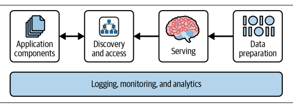
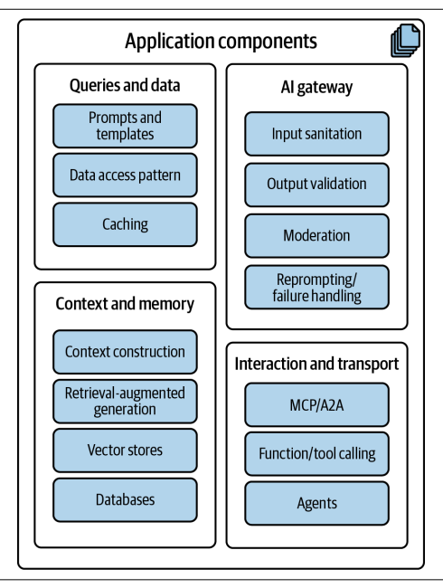
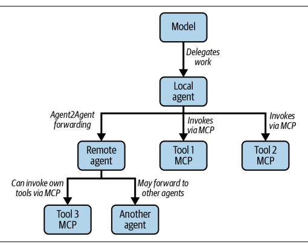
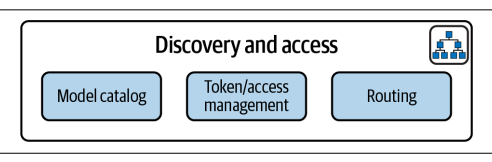
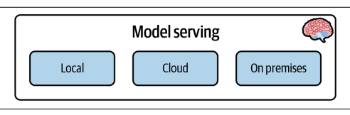
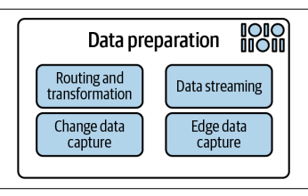

# 第4章：应用的AI架构

> **原文：** Applied AI Enterprise Java — Chapter 4: AI Architectures for Applications  
> **翻译页码：** 第85–109页（共432页）

---

与传统应用不同，AI驱动的系统在数据处理、模型集成、安全性和性能方面引入了新的挑战。开发者必须集成新的组件和模式，如RAG、向量数据库、函数调用Agent和动态缓存。对于经验丰富的Java开发者来说，访问控制、服务发现和数据流水线的概念并不新鲜——你已经花了多年时间应用这些原则来构建安全、可扩展和可靠的系统。

我们将更深入地探讨将这些相同的企业级模式应用到我们新的资源集合——模型、提示和数据——意味着什么。本章研究AI赋能应用的核心架构元素，以及开发者在实现这些元素时需要处理的因素。

---

## 超越传统架构：为什么AI赋能系统需要新方法

构建使用AI的企业应用不是添加一个新库或调用一个不同的API。这个过程需要思维上的转变。虽然良好软件设计的原则——模块化、可扩展性和可维护性——仍然适用，但AI赋能的系统引入了需要从不同视角并通过略微调整的解决方案来应对的新挑战。传统架构为确定性逻辑而构建，通常无法应对AI赋能应用的概率性和以数据为中心的本质。这对我们设计、构建和维护这类应用的方式具有重大影响。

传统应用遵循显式的、硬编码的逻辑。如果你用相同的输入调用一个方法，你期望每次都得到相同的输出。正如你在第2章学到的，AI模型——特别是LLM——的运作方式不同。它们的响应基于统计概率生成，这意味着即使使用相同的提示，响应也可能从轻微到显著地变化。这种非确定性需要能够处理模糊性、验证输出并实现护栏以引导模型行为、防止如幻觉或有害内容等不良结果的架构。为娱乐或社交媒体构建的聊天机器人通常是只读的。它可能建议笑话、生成故事或回答随意的问题。一个错误或奇怪的响应通常不会造成伤害。这些系统不会触发操作或连接到业务流程。模型输出通常只经过轻量过滤、句法护栏或验证就直接显示给用户。

现在考虑银行应用、保险系统或企业支持工具中的AI功能。AI可能建议产品变更、处理交易或影响财务决策。在这些情况下，糟糕的输出不仅仅是令人烦恼——它是危险的。系统必须是**可预测**和**安全**的。错误可能造成经济损失、引发法律问题或伤害用户。

这改变了你构建软件的方式。你不能只是插入模型然后寄希望于最好的结果。你需要检查、过滤和明确的边界。AI建议应该在任何数据被存储、显示或执行之前经过验证。你可能需要强制执行业务规则、将模型输出与预期格式进行比较，或在需要时回退到基于规则的逻辑。但这只是新挑战的一个方面。还有以下更多挑战：

**数据的核心地位**

在大多数企业应用中，数据是应用程序操作的对象。在AI赋能的系统中，**数据就是应用程序**——或者至少是其推理能力的核心部分。提供给模型的上下文，无论是通过用户提示、检索到的文档还是对话记忆，都直接塑造其输出。这就是为什么架构必须优先考虑上下文管理，并具备强大的数据输入、转换和输出机制。

**数据传输与格式**

数据在应用程序和模型之间的交换方式是另一个关键考量。虽然标准化的传输协议如HTTP/REST和gRPC提供了通信主干，但AI载荷的本质引入了新的需求。随着上下文窗口的扩大，单个请求的载荷可能很大，包含数千个token的对话历史和检索到的文档。这对性能和序列化造成了负担。此外，虽然你可以从LLM请求JSON等结构化格式，但响应并不能保证格式良好。模型可能生成格式错误的JSON或回退到纯文本，这要求应用架构包含一个健壮的验证和解析层来处理这种不可靠性。

**新的架构组件**

集成AI引入了在传统Java应用中不常见的新型组件。向量数据库成为启用RAG系统中语义和词汇搜索的关键。模型服务运行时是托管和管理推理模型生命周期所必需的。Agent框架为结合模型推理与外部工具的复杂工作流提供了编排层。理解每个组件的角色是设计功能系统的基础。虽然我们在本章中研究这些架构模式，但我们不会对每个组件进行深入的技术探讨。其中许多组件的实现方法在第6章及之后覆盖。

话虽如此，现在是时候走过AI赋能应用的核心架构支柱了。我们将探索这些组件如何配合在一起、它们如何相互交互，以及你如何利用它们在Java中构建健壮、可扩展和可维护的AI应用。

---

## 核心架构支柱概览：本章路线图

为了让你对新格局有一个扎实的概览，我们围绕四个关键架构支柱来组织本章。它们为理解AI赋能应用的各个类别——从面向用户的逻辑到底层基础设施——提供了一个框架。

我们将在图4-1的架构图上下文中引用它们。将这个图视为你的蓝图。它提供了一个高层次的视觉指南，展示每个类别中的组件，并说明它们如何相互交互。随着我们展开每一节，我们将在此图的基础上构建，添加细节并澄清系统各部分之间的关系。到本章结束时，你将对这一参考架构有一个全面的理解，并能够将其全部或部分地应用到你的自己的用例中。



**图4-1. 应用架构组件**

该架构松散地以Chip Huyen的博客文章"Building A Generative AI Platform"和她出色的著作《AI Engineering: Building Applications with Foundation Models》为蓝本，但已适配到Java生态系统和企业应用开发实践中。这意味着，当我们谈论训练和服务时，我们不会覆盖训练模型的细节，而是关注如何与现有的模型服务方法（平台或框架）集成，以及如何构建能够有效利用这些模型的应用。

让我们在以下各节中走过每个架构组件。

---

## 应用组件

图4-2概述了应用的**核心**。这是核心业务逻辑所在的地方。在这里选择Java是很自然的：它长期以来一直是构建需要可靠性、清晰结构和可执行业务规则的系统的首选语言。Java的优势在于其能够精确编码逻辑，使其成为事务工作流、验证和法规遵从的理想选择。相比之下，LLM擅长处理模糊性、生成灵活的响应和解释非结构化的输入。

当这两种范式结合时，它们相辅相成。Java提供稳定的基础和护栏，而LLM为应用中受益于类人推理的部分带来适应性和语言理解。这种平衡在设计必须在严格的业务约束下运行同时智能地响应开放式用户输入的AI赋能应用时至关重要。

让我们看看如何安全地映射输入和输出、为有状态交互构建上下文和记忆，以及设计能够在提供可靠合规输出的同时保持推理和行动灵活性的LLM交互。



**图4-2. 应用架构组件**

### 查询与数据：管理应用输入

每个AI交互都始于一个查询。这一层负责准备将发送给模型的数据，确保其完整、相关且格式正确。

**提示和提示模板**作为结构化的文本输入，指示AI模型做什么。模板是可参数化和可重用的，允许你插入动态内容或业务上下文。作为Java开发者，你将使用模板引擎或基本的字符串操作以编程方式构建这些提示。

在处理提示时，你几乎可以将它们视为SQL查询。从技术角度来看，它们秉承相同的原则。在基于原始JDBC的应用中，它们通常也是没有类型安全或检查的字符串表示。围绕将这些SQL字符串存储在单独文件中或使用模板引擎的最佳实践现在也适用于提示。你将希望以一种允许轻松更新、版本化和重用的方式存储它们。确保将它们与模型版本绑定，以便你可以追踪哪个提示与哪个模型配合最佳。随着模型随时间演进和改进，这一点尤其重要。像Hibernate为数据库查询所做的，你也想为提示做到。你可以使用像LangChain4j这样的库来帮助管理和版本化你的提示和提示模板。

目标是构建精确且上下文丰富的指令，帮助模型返回准确的结果。我们在第3章讨论了提示，以及它们是如何充分用LLM的关键。请随时回顾该章节以获取关于提示工程和如何设计有效提示的更多细节。

**检索正确的数据**来填充提示需要明确定义的访问模式。系统的这一部分使用常见的**企业模式**与你的业务数据源交互，如Repository类、DAO层或Service层。无论是提取用户信息、交易详情还是领域特定的记录，你的重点是安全高效地访问模型所需的数据。

虽然LLM的上下文窗口在不断扩大，但你检索的数据必须是**相关且简洁的**。这就是你将应用你的数据建模和访问模式知识的地方，以确保只有必要的信息被包含在提示中。也不要将此与MCP混淆，MCP是一个不同的概念，专注于模型如何按需收集上下文和状态信息（本章后面会更多介绍）。重要的是要构建应用逻辑和模型交互逻辑之间的关注点分离。这使你能够维护一个清晰的架构，其中应用可以独立于模型的能力演进。

为了**减少延迟**并避免冗余的模型调用，缓存成为一个有趣的选择。你可以使用Caffeine、Redis或Infinispan等工具来缓存提示、结果或中间数据结构——使用或不使用RAG模式。对于重复的问题或昂贵的查询，缓存不仅提高性能，还通过减少对LLM的总调用次数来帮助控制成本。在更高级的用例中，可以使用向量存储实现**语义缓存**，允许你基于含义而非字符串匹配进行缓存。

虽然我们在这里只用几句话触及这一点，但不要低估AI应用中缓存的复杂性。它不仅仅是存储最后一个响应；它是关于理解**何时**缓存、**如何**使缓存失效，以及如何确保缓存的数据随时间保持**相关和准确**。另一个重要方面是确保缓存是安全的，不会在用户会话之间意外暴露敏感信息。这在处理用户数据或业务敏感信息时尤其关键。这个领域也在不断演进，新的库和框架不断涌现以帮助有效管理缓存策略。Python方面的一个例子是GPTCache，它提供了一个基于语义相似度缓存LLM响应的框架。虽然这不直接适用于Java，但它说明了缓存在AI应用中日益增长的重要性，以及对能够适当处理复杂性的健壮解决方案的需求。

现在你已经准备好了数据，你需要确保它是**干净且安全**的以发送给模型。这就是输入验证和清理发挥作用的地方。

### AI网关：管理输入与输出

在你的应用和模型之间，有一个负责**信任、安全和容错**的层。这一层扮演着类似于API网关或过滤器链的角色，帮助强制输入和输出质量。根据复杂度，它可能是模型服务基础设施或应用本身的一部分，或两者兼有。我们这里只讨论应用侧，因为这是你将实现逻辑以确保模型交互安全、可靠且符合你业务需求的地方。

在将用户输入发送给模型之前，**输入清理**是必需的。此步骤清理和验证输入，以防止提示注入攻击，潜在地移除PII，检查GDPR要求，或仅确保一致的格式。作为Java开发者，你将实现保护系统免受畸形或恶意输入的逻辑，同时保留原始请求的意图。

一旦模型响应，**输出验证**对于确保这些生成的响应的准确性和可靠性至关重要。此过程涉及根据一组预定义的标准或规则检查输出，以确保其符合所需标准。这种验证有助于识别和纠正模型输出中的任何错误、不一致或偏见，从而提升生成内容的整体质量。

不充分的验证、清理和输出管理可能导致安全问题。事实上，**不安全的输出处理**已被OWASP（一个致力于改善软件安全的非营利基金会）认定为LLM应用的十大风险之一。

虽然LangChain4j等框架为输入和输出验证提供了内置机制，但你通常需要实现针对你特定应用需求定制的自定义逻辑，甚至添加像Presidio这样的特定库和框架。这可能包括检查特定关键词、验证JSON结构或应用业务规则以确保模型的响应是适当的。请记住，你**不能可靠地通过提示强制模型以JSON结构响应**。

在AI术语中，我们谈论的是**护栏（guardrails）**，它们是帮助确保模型按预期行为且不产生有害或非预期输出的机制。护栏可以包括提示过滤、输入验证和输出验证，以强制执行业务规则和伦理标准。跳到第12章看看如何在实践中处理。

**内容审核（Moderation）**是一个略有不同的概念。它基于预定义的规则甚至外部API引入内容过滤和检查。你可能需要检测和阻止包含不当语言、冒犯性内容或违反策略的响应。你甚至可以使用LLM来承担审核任务，用一个模型评估另一个模型的输出，以确定其是否符合所需标准。这是AI应用中的一种常见模式，特别是在处理用户生成内容或敏感话题时。

从架构的角度来看，尽可能靠近模型边界来处理这些检查：

- **LLM访问对象（LAO）** — 创建一个专用的集成组件——类似于数据库的DAO——拥有与模型的**所有**交互。LAO负责：调用供应商的SDK或REST端点；应用护栏（提示过滤、输入和输出验证）；向应用的其他部分暴露一个干净的Java接口。将安全措施放在这里可以集中风险，并保持服务层和业务层不受低级关注点的影响。
- **服务层** — 将LAO像其他基础设施依赖一样对待。服务层编排多个领域操作，决定何时查询模型，并在业务上下文中解释响应。如果业务规则需要多次模型调用或重试，这种编排属于这里，而不是LAO。
- **业务（领域）层** — 保持纯领域逻辑不感知LLM细节。领域实体永远不应依赖模型客户端或护栏代码。相反，它们从服务层接收已经验证的值。
- **缓存** — 模型调用是昂贵的。添加缓存，可以放在LAO内部以对上层隐藏缓存细节，或作为横切关注点使用Caffeine或Redis等工具，通过Spring的`@Cacheable`注入。将缓存与LAO放在一起更简单，并保持缓存键一致（通常是提示+参数）。

最后，当模型响应未能通过验证或产生不可用的输出时，你的应用应该支持**重新提示或回退处理**。这涉及用修改后的提示重试模型，或切换到预定义的备用路径。可以使用Resilience4j或SmallRye Fault Tolerance等工具实现重试逻辑。仔细设计失败路径确保你的应用即使在模型失败时也能保持功能。你可能会想起微服务以及它们如何处理失败。这里适用相同的原则：你想要确保你的应用能够优雅地处理模型失败，而不崩溃或产生不正确的结果。

在谈论用户输入时，一个反复出现的话题是**提示注入攻击**。当恶意用户试图通过注入有害提示或命令来操纵模型的行为时，就会发生这种攻击。这可能导致非预期的后果，例如模型生成不当内容或泄露敏感信息。它可类比于SQL注入攻击，攻击者试图操纵输入以执行任意命令。

没有防止提示注入攻击的标准方法，但你可以在输入验证和清理之上实施多种策略。它们都归结为**限制模型的权限**。确保模型只能访问其执行任务所需的数据和资源。这可以通过使用RBAC、租户概念或其他安全机制来限制模型的能力来完成。预先考虑到模型可能被欺骗泄露敏感信息或执行不应执行的命令也是好的做法。你可能需要与你的数据科学家或AI团队合作，定义模型能做什么和不能做什么的边界，并实施防护措施以防止其超出这些边界。

最后一个缺失的部分类似于你在传统企业应用中所做的：**监控和日志记录**。实施健壮的监控和日志记录机制以检测和响应提示注入尝试至关重要。我们将在本章后面触及这一点。

我们还没有讨论的是**测试**。彻底测试以确保你的输入验证和输出验证逻辑按预期工作。这包括对个别组件的单元测试、对整个流程的集成测试，以及模拟真实用户交互的端到端测试。你可以使用JUnit、Mockito或Testcontainers等工具来创建一个全面的测试套件，覆盖你AI赋能应用的所有方面。像Quarkus这样的框架使这变得容易，并为测试相关组件提供内置支持。

> ⚠️ **提示过滤和工程缓解措施应包括你应用可用的所有地区的所有语言。**这些缓解措施的有效性可能取决于语言和社区层面的细微差别。大多数基础级LLM的训练数据主要基于英语。因此，你有责任仔细评估其他语言的任何缓解措施，以确保它们对通用模型的有效性。

一旦用户输入被验证和清理，它就可以发送给模型了。这是架构的下一层发挥作用的地方。LLM是**无状态的**，意味着它们不保留之前交互的任何记忆。这与传统应用有着根本的不同，在传统应用中，状态通常通过会话数据或数据库记录来管理。在AI赋能的系统中，你必须显式管理上下文和记忆。

### 上下文与记忆

**上下文与记忆层**在每次推理之前组装模型所需的每一条信息。该层接收原始用户请求，用最近的对话、相关的领域数据和按需获取的任何业务事实来丰富它，然后将完成的提示交给LLM。在运行时，这个过程对调用者是不可见的；在底层，它依赖一小组定义良好的组件，这些组件跨多个存储层级协同工作。例如，LangChain4j的默认记忆选项——用于简单历史存储的`ChatMemory`和用于在固定token预算内自动修剪的`ContextWindowChatMemory`——对原型和适度对话效果良好，但真实世界的系统很快就需要更多。

监管聊天机器人、医疗助手和协作工具必须跨长会话保留领域特定的事实，满足留存和审计规则，跨登录召回用户特定的数据，并将对话与结构化的业务实体合并——这意味着你需要自定义的记忆服务来总结、持久化和丰富上下文，同时仍然呈现相同的轻量级接口。这需要一种比大多数框架中提供的默认方案更复杂的上下文管理方法。特别是，你需要考虑如何处理长期记忆、会话记忆和快速缓存，以及模型的上下文窗口限制。

接下来你将看到一个更复杂和分层的`MemoryContextCompressor`示例，展示了增量压缩方法如何满足这些需求，而不强制下游代码进行更改。如表4-1所概述的，你可以组合多个存储层级来满足速度、成本和准确性的各种需求。

**表4-1. 记忆实现的存储层级**

| 目的 | 潜在实现 | 典型技术选择 |
|------|----------|-------------|
| 快速缓存：重用系统提示、最近的搜索结果 | `@CacheResult`或通过Quarkus缓存扩展的Caffeine | Caffeine, Infinispan |
| 短期会话记忆：最后N轮对话 | `ChatMemoryProvider`实现（`FactoryContextCompressor`） | Redis, Hazelcast, 进程内Map |
| 语义记忆：长期知识、RAG文档 | 从检索步骤调用的`VectorStoreService` | pgvector, Milvus, Pinecone |
| 冷存储/真实数据源：很少使用但持久 | 批量摄入流水线 | S3, 关系型数据库 |

一个简单的"回放所有历史"策略在对话超出LLM的上下文窗口后就失败了。下面的`MemoryContextCompressor`示例采用了增量、锚定压缩，具有以下特性：

- **阈值** — 两个可配置的限制驱动该过程：`tMax`（触发压缩）和`tRetained`（压缩后的目标大小）。
- **锚定消息** — 每次超过`tMax`时，只有自上次锚定以来的新聊天消息片段被总结。摘要作为关联到其锚点的系统消息存储，防止对旧内容的昂贵重新总结。
- **智能合并** — 一个专用的`SummarizerService`（LangChain4j `@AiService`）将现有摘要与新的合并，使意图、高级步骤、产物轨迹和面包屑在剪切后仍能保留。
- **事务性持久化** — 一个Panache Repository在单个事务中存储`ConversationSession`、`ArchivedMessage`和`PersistentSummary`实体，使状态永远不会变得不一致。
- **可观测性** — Micrometer计数器、计时器和量表记录压缩事件、延迟和节省的token；Prometheus在`/q/metrics`暴露它们用于仪表盘和告警。
- **基于Profile的调优** — Quarkus配置profile（`%qa`、`%debug`等）允许你通过调整`compressor.tMax`和`compressor.tRetained`来在延迟和保真度之间权衡——无需重新编译。

示例实现如下：

```java
@ApplicationScoped
public class MemoryContextCompressor implements ChatMemoryProvider {
    @Inject ConversationRepository repo;
    @Inject SummarizerService summarizer;
    @Inject Tokenizer tokenizer;
    @Inject CompressorConfig cfg;
    @Inject MeterRegistry metrics;

    @Override
    public ChatMemory get(Object id) {
        var state = repo.loadState(id);
        var total = tokenizer.count(state.context());
        if (total > cfg.tMax()) {
            compress(state);
        }
        return state.toChatMemory();
    }
    // update(...) 持久化新消息；delete(...) 清理会话
}
```

这里，应用代码只与一个常规的LangChain4j `AiService`交互；压缩器被自动注入并保持提示窗口在控制范围内。因为记忆提供者位于Quarkus的CDI容器中，你可以交换实现（例如，为快速原型使用一个简单的滑动窗口）而不触及堆栈的其他部分。为了在你的AI赋能应用中实现有效的记忆处理，你必须牢记以下高级方面：

- 将上下文组装与业务逻辑分离；将上下文作为一个可注入的服务暴露。
- 组合多个存储层级以满足延迟、成本和准确性目标。
- 使用增量压缩以避免指数级的摘要成本和漂移。
- 将提示和阈值视为配置——像代码一样进行版本化、测试和监控。
- 尽早捕获指标；你将需要真实的数字来论证之后与记忆相关的token支出。

> 📚 LLM记忆和上下文处理的研究正在快速发展。Factory最近演示了一个面向生产的"锚定压缩"工作流，在保留关键状态的同时实时修剪对话。学术研究从不同角度解决这个问题：MemLong通过一个外部检索器增强生成，该检索器仅注入长历史中最相关的片段；LongRAG将长上下文检索器和阅读器结合以减轻RAG流水线中的检索负载；内存高效的双重压缩通过联合压缩提示和模型参数进一步推动这一思想，以同时节省token和硬件预算。预计本章讨论的技术将迅速演进。请关注新的论文、基准和复现报告，以保持你的架构与时俱进。

### 交互与传输：使用工具与Agent

最后一层处理模型如何与你的应用和其他系统通信。这一层定义了传输机制、执行协议以及LLM与你的系统的交互行为。

**函数或工具调用**允许模型请求在你的Java应用中执行特定函数。你已经在第2章看到了一些这个过程。记住，这种回调机制使模型能够调用方法来获取数据、执行计算或根据其推理触发操作。这是一个强大的特性，使模型能够将其能力扩展到文本生成之外。例如，如果用户询问当前天气，模型可以调用天气API检索实时数据，而不是生成静态响应。

这个特性是模型的语言生成和应用逻辑之间的**桥梁**。你将定义哪些函数对模型可用、如何调用它们以及如何返回结果。这在某种程度上类似于在传统应用中暴露RESTful API或gRPC服务，但要简单得多。以LangChain4j为例，只需用`@Tool`注解你的Java方法并提供必要的元数据即可。我们在第12章简要介绍这种新方法。

随着应用超越单次提示-响应交互，并在单个应用中调用更多工具或使用多个模型，它们需要一个更复杂的协调模型。这就是**Agent**发挥作用的地方。Agent代表一个**推理循环**，允许模型不仅生成响应，还能以结构化的顺序做出决策、规划操作和调用工具。这种方法对于解决需要多步骤工作流、动态工具使用和访问外部系统的复杂任务特别有用。

Agent代表了更高级交互模型的下一个层次，其中AI协调多个LLM和工具调用来解决复杂问题。基于Agent的架构需要更多的集成逻辑。你不是定义单次工具调用，而是设计工作流，允许模型推理要调用哪些工具、以什么顺序以及使用什么参数。这意味着实现一个控制循环或工作流来管理Agent的状态、跟踪其进度并处理失败或重试。这些系统需要小心的编排和状态跟踪，特别是在处理异步或部分可观察的环境时。

**用规则引擎补充Agent。** 保持这种编排确定性的一种行之有效的方法是将策略决策——例如工具选择约束、速率限制或审批关卡——委托给像Drools这样的规则引擎。Drools将规则逻辑存储在你的提示和代码之外；引擎评估Agent循环产生的事实，并仅触发匹配的规则。由于Drools支持前向和后向链式推理，你可以表达复杂的条件流程（"如果请求来自欧盟且涉及个人数据，在将载荷发送给LLM之前调用匿名化器"），而无需在Agent代码中散落if/else块。将规则引擎视为又一个被动MCP工具：Agent将当前上下文作为事实提交，接收一个明确的决策，然后相应地继续其推理循环。将这些护栏外部化提高了可维护性，并使合规审查更容易。

随着这些交互复杂性的增加，标准化的通信协议正在演进。**MCP**是一个标准化接口，允许Agent和应用通过基于HTTP的请求和响应从外部工具和服务中检索结构化上下文或触发操作。

类似地，**Agent2Agent（A2A）协议**定义了Agent之间或Agent与（基于MCP的）工具服务器之间通过标准化接口进行通信的框架。这支持跨服务边界的分布式推理和工具使用，使得构建模块化、可重用的Agent工作流成为可能，而不依赖组件之间脆弱的自定义连接。

图4-3显示了Agent、MCP和A2A如何协同工作的高层概览。该架构遵循严格的单向控制流：模型将任务委托给本地Agent，然后Agent有两个主要选择——通过MCP调用简单返回结果的被动工具，或当任务更适合在其他地方处理时通过A2A通信将请求转发给其他Agent。这种模式递归地扩展——远程Agent可以通过MCP调用自己的工具，并潜在地转发给其他Agent，但基本规则保持不变：Agent始终是发起者，工具是被动响应者，永远没有反向回调或双向流，确保一个干净且可预测的系统架构，其中控制总是从模型向下流向Agent再到工具。



**图4-3. Agent、MCP和A2A**

MCP和A2A都是旨在提高Agent系统健壮性和可扩展性的新兴标准。它们允许开发者更干净地分离职责。模型可以专注于推理，工具可以专注于执行，基础设施可以处理协调和策略强制执行。对于Java开发者来说，实现对这些协议的支持通常意味着构建遵循约定模式的基于HTTP或消息传递的接口。

> 🔌 **使用Wanaku路由MCP流量。** 如果你不想自己构建这些管道，Wanaku提供了一个基于Apache Camel和Quarkus构建的开源MCP路由器。你将Wanaku作为sidecar或中心网关运行；它认证传入的MCP调用，应用路由规则，并将请求转发到正确的下游工具或Agent。因为Camel已经提供了数百个连接器，你可以将你的Agent工作流接入遗留队列、SaaS API或本地系统，而无需编写自定义适配器。简而言之，Wanaku为你提供了一个即插即用的MCP流量"消息总线"，让你可以专注于Agent逻辑而不是连接管理。

如果这些听起来有些熟悉，那是因为Agent和工具调用的概念并不完全是新的。它们类似于你在构建微服务时使用的模式。服务相互调用、共享数据并协调工作流。区别在于现在协调通常由AI模型驱动，而不是显式的业务逻辑。另一个变化是协议和消息格式。虽然企业集成传统上依赖SOAP、REST或gRPC，但新的以AI为中心的协议如MCP和A2A被设计为围绕简单HTTP交互和JSON载荷的轻量级协议。

随着组件日益分布式化以及可用协议的增加，考虑这些组件将如何被发现和访问变得很重要。这带我们进入下一个架构支柱。

---

## 发现与访问控制

在应用可以使用模型之前，它需要**找到**它、**认证**并**获取权限**。这一支柱涵盖了通过目录进行模型发现的机制、通过token管理进行访问控制以及安全的交互协议（见图4-4）。



**图4-4. 发现与访问控制组件**

访问控制就像保护端点：你不会在没有认证和授权的情况下暴露关键业务服务。同样，AI模型是强大（且通常昂贵）的资产。作为开发者，你不直接负责实现控制谁能调用特定模型、强制执行速率限制以管理成本或审计使用以确保合规的机制，但你需要确保这些机制已经到位并且你可以使用它们。

得益于既定的安全实践，你大多可以利用现有的企业安全框架来管理对AI模型的访问。这包括与身份提供者（IdP）集成进行用户认证，使用OAuth2进行基于token的访问，以及对模型服务API应用RBAC。这对Java开发者来说并不是新概念，因为你多年来一直在应用中实施安全措施。同样的原则在这里适用，但侧重于AI模型及其特定需求。你需要确保你的应用能够安全地认证用户、管理访问token并强制执行AI模型的使用策略。

一个经常被忽视的方面是**速率限制和配额**。并非所有推理基础设施都原生支持这些，因此你可能需要实现自定义逻辑来强制限制用户或应用在给定时间范围内可以对模型发出的请求数量。你可以使用Bucket4j或Resilience4j等工具有效地处理这个问题。

另一方面，**模型发现**就是新的服务发现。在微服务环境中，你依赖服务注册中心（如Consul、Eureka或Kubernetes服务）来发现和与其他服务通信。**模型目录**服务于相同的目的。你的应用需要一种可靠的、可编程的方式来发现哪些模型可用、它们的版本、它们的能力和它们的端点位置。这不仅仅关乎找到一个模型；它关乎构建弹性的应用，当模型被更新或替换时能够适应，这是一个经典的集成挑战。

密切关注**模型版本化**。随着模型的演进，你需要管理多个版本以确保向后兼容，避免应用中的破坏性变更。这类似于处理RESTful服务中的API版本化。你需要实施一种模型版本化策略，包括如何检索特定版本、如何处理废弃，以及如何确保你的应用能够在版本之间优雅地过渡而不中断用户。

一些云服务提供注册表功能。但其中很多是为数据科学家设计的，不一定考虑了应用开发者的需求。你需要确保你的应用能够与这些注册表交互并检索关于模型的必要信息。Kubeflow Model Registry是一个模型注册表的例子，它提供了在Kubernetes环境中管理和发现模型的方式，允许你注册、版本化和发现模型。如果你在使用Backstage或类似的开发者门户，你也可以将模型发现集成到组件目录中。

最后，发现与访问控制支柱融入为推理提供模型服务的基础设施。这就是模型服务运行时发挥作用的地方。

---

## 模型服务

在AI赋能的应用中，**模型服务**这个术语可能会令人困惑。作为Java开发者，我们通常不负责扩展模型推理或构建服务基础设施。我们的主要关注点在于如何将我们的应用连接到已经被服务的模型。我们关心如何调用这些模型、对它们进行测试，以及在我们代码中安全地使用它们的结果。

今天许多模型通过HTTP API可用。这些包括像OpenAI、Hugging Face这样的服务，或基于llama.cpp或vLLM等框架构建的内部API（更多内容在第5章）。其中一些遵循像OpenAI API格式（见第6章）或MCP这样的标准。这些标准帮助我们编写跨供应商一致工作的客户端代码。

在开发过程中，我们通常需要一种可靠且快速的方式来运行模型。基本上，我们有三个选项，如图4-5所示。像Ollama这样的本地模型服务器让你无需依赖互联网或外部API即可进行测试。在本地运行模型帮助你更快工作，避免速率限制或不稳定的上游变更等问题。云托管或本地部署模型对生产来说很棒，但在开发中可能既慢又贵。许多开发者更喜欢在开发和测试期间本地运行模型，然后切换到云端或本地服务器用于生产。



**图4-5. 开发者的模型服务选项**

测试在任何地方都是关键的，这一点永远不会改变。你应该编写与模型对话的集成测试，就像你的应用会做的那样。这些测试应该检查有效响应、处理错误情况，并确保你的提示格式化按预期工作。像Testcontainers这样的工具让你在测试期间在容器中运行模型服务器，这使你的测试自包含且可重复。

使用Docker或Podman是打包模型服务器的好方法。如果你的团队在Kubernetes中运行模型，你可以在本地模拟。这帮助你在推送变更到共享环境之前尽早发现问题。有很多选项可以做到这一点，我们在第5章的第二部分专门介绍这些。

为了支持本地开发和测试，Java开发者需要轻量级、可测试的AI模型版本。这些版本不需要是生产级别的或为规模完全优化的。相反，它们应该启动快、容易在标准硬件上运行，并在不同环境中行为一致。出于这个原因，我们要求数据科学团队提供适合本地和CI使用的**量化版本**的模型。

在为应用集成准备模型时，以下需求是重要的。确保在项目早期与你的数据科学团队讨论这些，以确保你需要的模型以适合你的Java应用良好工作的格式可用：

- **量化格式** — 模型应以适用于常见本地推理引擎的量化格式（例如4位或8位）可用。（回忆你在第2章学到的关于量化的内容。）
- **标准化接口** — 模型应通过一致的HTTP API提供服务，该API与生产中使用的结构匹配（例如，OpenAI兼容的端点或MCP）。不要使用需要特殊库或SDK的自定义或专有API。
- **版本化** — 每个模型版本应有一个清晰的标识符。这允许应用锁定特定版本并避免非预期的变更。
- **示例输入/输出** — 请求用于集成测试的示例提示和响应。这些应覆盖常见和边缘情况。确保在测试中使用与生产相同的提示，并与数据科学团队协调预期行为。
- **启动说明** — 确保模型访问可以在团队之间扩展。像记录其他每个下游依赖一样记录模型启动或访问。
- **行为一致性** — 本地和生产版本对于相同的输入应表现相似，即使量化版本的响应质量稍低。

通过提供具有这些属性的开发就绪的模型构建，数据科学团队帮助减少了集成摩擦。这种方法使Java开发者能够在开发期间尽早测试、轻松调试和构建依赖AI的功能，而无需云访问或完整的生产技术栈。

乍一看，模型版本化可能类似于API或库版本化，但在实践中，它引入了新的挑战，特别是在使用来自云供应商的托管模型时。作为Java开发者，我们习惯了语义版本化、向后兼容和清晰的废弃路径。对于AI模型，情况通常非常不同。

许多云供应商暴露像`gpt-4`或`gpt-3`这样的模型名称。这些名称通常随时间指向**变化的实现**。例如，`gpt-4`端点可能开始服务一个更新、更高效的变体，而不改变端点名称或API结构。这最终将导致模型行为、输出风格或延迟的变化。这些变化并不总是显而易见的，可能在没有警告的情况下影响你的应用。

这种动态行为对依赖一致性响应的应用带来风险。模型解释提示或格式化输出的方式的微小变化可能破坏验证逻辑，导致前端渲染问题，或中断业务工作流。例如，如果你的代码期望可预测的JSON结构，但模型开始生成略有不同的键或格式，你可能会遇到解析错误或不正确的结果。

为了减少这种风险，一些供应商提供**固定的模型版本**。例如，OpenAI发布静态模型快照如`gpt-4-0613`和`gpt-3.5-turbo-1106`。这些版本固定到特定发布版，不会随时间改变。

作为Java开发者，将模型版本视为可能随时间变化的**外部服务**。不要假设模型行为将保持一致。相反，**记录**你的应用依赖的模型版本，**构建**验证响应结构的测试用例，并**实现**错误处理以防输出不再符合预期。

在可能的情况下，在本地和测试环境中使用**相同的模型版本**。这使你能在开发早期捕获版本特定的问题。将版本固定与本地推理配对，例如通过容器服务的量化模型，可以让你对组合行为有更大的控制。

当我们谈论模型服务时，我们还需要考虑输入这些模型的数据准备流水线。这就是下一个架构支柱发挥作用的地方。

---

## 数据准备流水线

"垃圾进，垃圾出"这句话从未如此贴切。对于任何AI驱动的应用，输入数据的质量直接影响性能和可靠性。但是等等，这不是关于训练模型，对吧？Java开发者不是数据科学家。那我们为什么要关心数据准备？

作为Java开发者，我们已经熟悉使用Apache Kafka、Apache Camel、Debezium和各种批处理框架等技术构建坚实的数据处理流水线。这些**完全相同的**框架和技术在向AI工作流提供数据时发挥作用，如图4-6所示。



**图4-6. 数据准备流水线**

这就是为什么我们需要在本书中触及数据准备，至少在架构层面上。现有模型的大部分训练数据是从公共数据集准备的。它们使模型能够学习语言模式、事实和推理技能。然而，在构建AI赋能的应用时，你通常需要为特定用例准备自己的数据。你要么帮助数据科学家准备用于微调的训练数据，要么创建输入RAG或向量数据库的数据流水线，以帮助模型更了解上下文并与你的特定业务领域相关。

这根本上是数据工程任务，它位于业务数据深埋在ERP和后端系统中的地方，这些系统运行在JVM支持的基础设施上并与之集成。

进一步说，数据准备不仅仅是关于将记录从一个地方复制到另一个地方。通常数据需要被路由、转换、丰富和清理才能变得有用。例如，在为语义搜索索引文档时，你可能需要移除HTML标签、提取元数据、将大文件拆分为较小的部分，或将XML转换为JSON。Apache Camel或类似框架让你以结构化的方式构建这些路由和转换步骤。借助Wanaku等项目，你可以在其上获得与MCP的直接集成。

**流数据**也很重要。AI系统通常需要使用实时或频繁更新的信息。Kafka非常适合这个。你可以实时流式传输更新，并使用Kafka Streams或小型服务在数据被存储或索引之前清理和准备数据。这使你的AI模型能够感知业务中正在发生的事情，而不依赖缓慢的批处理作业。

**变更数据捕获（CDC）**是另一个有价值的工具。它让你检测数据库中的变更并将其转换为事件。Debezium等工具可以流式传输这些变更，使你的应用或AI系统能够立即响应。例如，如果客户更新了他们的资料，该变更可以被捕获并反映在你的AI使用的向量存储或其他系统中。

在工业环境或分布式系统中，数据通常来自**边缘**设备。这些可能是传感器、机器或嵌入式设备。由于有限的连接性或特殊协议，捕获这种边缘数据更难。使用MQTT、CoAP或HTTP API的Java开发者可以将这种数据带入中央系统。

大多数时候，你用于AI的数据已经**在你的系统中**。它可能在数据库、消息队列或后端服务中。Java开发者的工作是确保这些数据可用、干净，并以AI系统可以使用的方式结构化。你可能不会编写完整的AI流水线，但你在使数据流工作方面扮演着关键角色。

你也处理许多格式和协议。你可能从JDBC读取，调用REST或gRPC服务，从JMS消费消息，以及处理JSON、XML或CSV。每个来源带来自己的挑战。拥有良好的验证、转换和日志记录有助于保持你的应用流程和数据传输可靠和安全。对Java开发者来说没什么可怕的，对吧？你已经做了很多年。欢迎来到AI的世界，在这里同样的技能适用，但重点是为模型准备数据而不仅仅是应用。你在应用你从企业集成中已经知道的东西。最佳实践包括模块化代码、适当的错误处理和清晰的逻辑分离。无论数据是流向模型、向量数据库还是提示，你的工作确保它以正确的形式到达那里。

> 💪 **Java开发者不会消失，这是件好事。**虽然AI炒作周期可能让一些人去抓最近的Python脚本，但将其集成到带有CICS或IMS的大型机环境中，其乐趣大约相当于用正则表达式解析COBOL。试图在生产环境中将Python连接到MQ Series消息传递是通往午夜支持电话的快车道。现实是，企业系统不在Notebook上运行；它们运行在多年的Java代码、事务管理器和需要稳定安全的消息主线上。当明天的应用需要将AI与关键业务逻辑、安全的数据访问和受监管的环境融合时，Java开发者仍将是把一切紧密联系在一起的支柱——使用强类型代码和久经考验的工具。

说到久经考验的工具：我们架构中的最后一块是可观测性和监控。

---

## 可观测性与监控：端到端AI技术栈

在大规模AI系统中，可观测性发生在多个层次。GenAI平台（如Huyen Chip的工作中所述）已将可观测性内建到GenAI平台中，重点是透明的监控。这些平台对模型内部具有深度可见性。数据科学家和基础设施团队可以追踪token分布、激活模式、训练数据集质量和微调指标。他们可以通过查看模型是如何被训练和服务的来调试为什么模型产生某个输出。

另一方面，Java应用没有那种级别的访问权限。作为Java开发者，你通常将模型视为一个**封闭的黑盒**。你发送一个提示，得到一个响应。模型内部发生的事情超出你的控制。这使得测试和监控与模型或平台团队所做的非常不同。在基于Java的AI赋能应用中，你的工作是**从外部观察**模型的行为。你需要测试输入和输出。你需要检查模型是否以你期望的格式给出答案、是否遵循业务逻辑，以及是否平滑地集成到系统的其余部分。这不需要知道模型内部如何工作，但确实需要仔细关注你的应用与它的交互方式。

**从捕获基础开始。**你的应用已经在记录请求、响应和错误。将其扩展以包括模型交互。使用LangChain4j，每次对模型的调用都是受控的API调用。记录提示、模型响应、经过的时间和可能使用的token量。如果你使用多个步骤或工具调用，将它们作为结构化日志的一部分。这为你提供了每次AI交互的完整记录。例如，如果你使用Camel路由，你可以使用Camel日志组件并以结构化的方式包装模型交互。这允许你稍后轻松地过滤和分析日志。

**使用你现有的可观测性工具。**如果你的应用使用OpenTelemetry或Micrometer，你可以围绕AI操作创建span或指标。记录模型调用的延迟、重试次数，以及调用是从缓存处理还是发送给模型供应商。这与你现有的仪表盘中的数据库查询或REST调用并列。

从Java端**监控模型性能**意味着知道响应何时退化。添加逻辑来验证模型输出。如果你期望结构化JSON，检查格式。如果结果用于工作流，追踪响应何时未能通过验证或导致下游错误。这些指标是模型或提示构建中某些内容需要审查的信号。

RAG系统依赖**良好的数据**。如果你的Java应用使用检索到的文档构建提示，记录使用的文档。如果检索失败，也记录下来。如果你与向量存储交互，你也可以记录相似度分数和向量搜索延迟。这有助于识别影响响应质量的RAG流水线中的问题。

也要考虑**业务级别的监控**。如果模型辅助定价、财务决策或客户服务，追踪关键结果。某些提示是否导致更多的错误、退款或升级？这些指标属于你的遥测数据，并有助于评估AI功能对业务的影响。

在一个完整的AI技术栈中，你的应用是**一切连接的枢纽**。你控制提示、工具、回退逻辑和错误处理。这意味着你的应用应该发布事件和指标，帮助其他人理解AI在做什么。一个只显示模型服务健康状况的监控仪表盘是不够的。你需要可见性来了解Java应用**如何**使用模型以及这种行为**如何**影响用户。

你还需要考虑**隐私和安全**。如果你记录提示和响应，在写入日志之前（如果必须的话！）屏蔽敏感值。尊重用户数据并遵循合规规则。适当设置日志级别，使生产日志只包含监控和调试所需的数据。

你可能还没有问的是**如何测试这些指标**。编写模拟AI响应并验证你的应用如何反应的集成测试。检查指标是否被发出、日志是否结构正确，以及边缘情况是否在你的仪表盘中可见。可观测性应该成为你测试覆盖的一部分，而不是事后才想到的。

**平台可观测性和应用可观测性之间的区别在于关注点。** 平台团队查看模型内部。应用团队查看模型如何影响用户。两者都很重要。如果平台检测到漂移，他们可以重新调整模型。但如果你的应用因为一个非预期的输出而中断，用户会感受到痛苦——即使平台指标看起来很好。

---

## 本章小结

在本章中，我们研究了将AI集成到企业应用中需要从传统的确定性架构转变到能够围绕AI模型的概率性行为工作的设计。与具有可预测输出的传统系统不同，AI增强的应用必须准备处理可变的响应，这引入了对输出验证、过滤和使用护栏以保持可靠性的策略的需求。

我们还强调了数据在AI系统中的**核心角色**。数据不仅仅是输入，而是应用推理过程的关键部分。这使得数据流水线、上下文管理和传输机制成为关键的架构关注点。HTTP、REST和gRPC等技术在处理现代AI上下文窗口所需的大载荷时变得特别重要。

本章介绍了一些新的架构组件，这些组件现在对AI赋能应用至关重要。这些包括支持语义搜索的向量数据库、管理推理的模型服务运行时，以及协调更复杂行为的Agent框架。我们围绕四个主要支柱组织了这些元素：**应用组件、发现与访问、训练与服务，以及数据准备**，使用参考架构来提供清晰性和一致性。

这些主题共同为构建有效的AI驱动系统奠定了架构基础。在下一章中，我们将从概念转向实现，重点关注如何使用嵌入向量、向量存储和本地模型执行，使用实用的工具和示例。

在第5章，我们将揭开下一层，更深入地探讨嵌入向量以及它们如何捕获文本输入的语义含义。此外，我们提供使用Ollama和容器化环境等工具在本地运行模型的动手示例。简而言之，第5章在本章的架构基础上提供了详细、实用的见解。它将帮助你从理解"为什么"和"在哪里"转向实现"如何做"，为你提供开始构建AI赋能组件所需的工具。

---

*翻译：第85–109页（第4章完） | 原书共432页*
